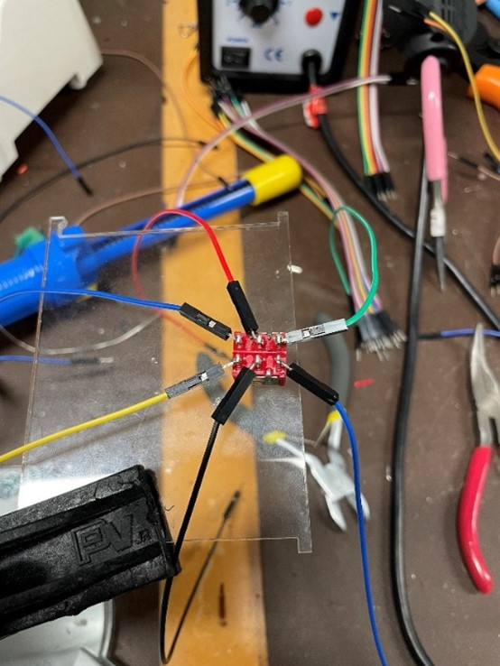

### Materials:
- “Useless box” pieces cut from SVG files (recommended: Acrylic 3mm thickness) - this requires a special laser cutter and training. You can look for some \pre-made options, see below, or try a different mechanism to produce similar pieces (see an option below).
    - Each box requires 2 sheets that are 8x10 large [Clear acrylic sheet](https://www.amazon.com/KAITELA-Rectangle-Plexiglass-Painting-Projects/dp/B0987L4WFR/ref=sr_1_3?adgrpid=1330409642782912&hvadid=83150843010174&hvbmt=be&hvdev=c&hvlocphy=71326&hvnetw=o&hvqmt=e&hvtargid=kwd-83150963464972%3Aloc-190&hydadcr=7345_13216502&keywords=acrylic%2Bsheet%2B3mm&qid=1663801887&sr=8-3&th=1)
- Toggle switch (red switch on top) [5 Pcs ON OFF ON 6 Terminals Double Pole Dual Throw Toggle Switch 6A 125V AC|Switches| - AliExpress)](https://www.aliexpress.com/item/2251832710089207.html?aff_platform=true&aff_short_key=UneMJZVf&isdl=y&src=bing&pdp_npi=2%40dis!USD!1.68!1.66!!!1.97!!%40!65756833234!ppc&msclkid=f50a32c5387211ed8cac8ef02f67670c)
- Limit switch (black switch on bottom) [Omron Electronic Components - D2F-L-A - Switch, Snap Action, Subminiature, Hinge Lever, 80G Of, Pcb Terminal Right Angle - Allied Electronics & Automation, part of RS Group](https://www.alliedelec.com/product/omron-electronic-components/d2f-l-a/70175825/?gclid=e7c6b77e9caa136d7b6ad456674473a9&gclsrc=3p.ds&msclkid=e7c6b77e9caa136d7b6ad456674473a9&utm_source=bing&utm_medium=cpc&utm_campaign=Search%20%7C%20Parts%20%7C%20US%20%7C%20N-RLSA%20%7C%20Omron%20Electronic%20Components%20%7C%20IMP_EX_GR&utm_term=d2f-l-a&utm_content=Parts%20%7C%20Omron%20%7C%2070175825)
- 2 or 3 AA battery pack/holder [2X 1.5V AA Battery Holder Case with On/Off Switch and Wire Leads](https://www.amazon.com/QTEATAK-Battery-Holder-Switch-Leads/dp/B08119TXFH/ref=sr_1_48?crid=2ZAUUWSU1AFLF&keywords=battery+pack+aa&qid=1663631060&sprefix=battery+pack+aa%2Caps%2C150&sr=8-48)
- 2 or 3 AA Batteries (depending on the battery pack/holder) [Alkaline Batteries](https://www.amazon.com/QTEATAK-Battery-Holder-Switch-Leads/dp/B08119TXFH/ref=sr_1_48?crid=2ZAUUWSU1AFLF&keywords=battery+pack+aa&qid=1663631060&sprefix=battery+pack+aa%2Caps%2C150&sr=8-48)
- 400 Pin Breadboard (can be switched out with smaller breadboard if needed) [Prototype Board](https://www.amazon.com/DEYUE-breadboard-Set-Prototype-Board/dp/B07LFD4LT6/ref=sr_1_3?crid=2IGK1BCDJ71ED&keywords=small+breadboard&qid=1663630882&sprefix=small+breadboard%2Caps%2C121&sr=8-3)
- Motor [90 Degree Shaft](https://www.solarbotics.com/product/gm3/)
- 12 jumper wires [Jumper Wires 20cm Wire Length](https://www.amazon.com/EDGELEC-Breadboard-Optional-Assorted-Multicolored/dp/B07GD2BWPY/ref=sr_1_1_sspa?crid=3H2K8EQ4GPDUX&keywords=jumper+wires&qid=1663793819&sprefix=jumper+wire%2Caps%2C153&sr=8-1-spons&psc=1)
    - 2 black
    - 2 red
    - 2 yellow
    - 3 blue 
    - 3 green
- 2 Screws (#2-28 X 3/8") for limit switch [Steel Thread Rolling Screw for Plastic](https://www.amazon.com/Thread-Rolling-Plastic-Plated-Phillips/dp/B00GDXU8AA/ref=sr_1_1?adgrpid=1343603773188892&content-id=amzn1.sym.918a99dd-4826-4c0a-be33-a6705d69c4cf%3Aamzn1.sym.918a99dd-4826-4c0a-be33-a6705d69c4cf&hvadid=83975476779793&hvbmt=bp&hvdev=c&hvlocphy=71326&hvnetw=o&hvqmt=p&hvtargid=kwd-83975579182048%3Aloc-190&hydadcr=289_1014987004&keywords=Screws&pd_rd_r=a70a1310-d4b1-4756-9dc1-d79ff6484b53&pd_rd_w=EkKti&pd_rd_wg=3UCAc&pf_rd_p=918a99dd-4826-4c0a-be33-a6705d69c4cf&pf_rd_r=0RRZA1AE1EZ9793X1SGA&pid=4aqsy5C&qid=1663795592&refinements=p_n_feature_fourteen_browse-bin%3A17910830011%2Cp_n_feature_twenty-eight_browse-bin%3A19043647011%2Cp_n_feature_two_browse-bin%3A2292861011&s=industrial&sr=1-1)
- 2 screws (#6-32 X 1/2”) for motor [Steel Thread Cutting Screw](https://www.amazon.com/Thread-Cutting-Plated-Finish-Phillips/dp/B00GWZZSMW/ref=sr_1_6?content-id=amzn1.sym.918a99dd-4826-4c0a-be33-a6705d69c4cf%3Aamzn1.sym.918a99dd-4826-4c0a-be33-a6705d69c4cf&keywords=Screws&pd_rd_r=624a407a-0655-4b32-a6cb-cf32f9d51be0&pd_rd_w=HIT7W&pd_rd_wg=EofiN&pf_rd_p=918a99dd-4826-4c0a-be33-a6705d69c4cf&pf_rd_r=WG4EWQ5SB4RJVF9B186Q&pid=IpTgsYo&qid=1663796458&refinements=p_n_feature_fourteen_browse-bin%3A11433959011%2Cp_n_feature_twenty-eight_browse-bin%3A19043652011%2Cp_n_feature_thirteen_browse-bin%3A15245623011%2Cp_n_material_browse%3A17548979011%2Cp_n_feature_two_browse-bin%3A2292861011&s=industrial&sr=1-6)
- All pieces as provided for students (Previously laser cut acrylic pieces 1-9 are labeled, 3 battery, battery pack, 3 batteries, 400 Pin breadboard) 

Another option, which can be a bit more expensive but saves much of the pre-work and tools/skills needed to set it up, is to buy a pre-made kit similar to this one:
https://www.amazon.com/Acogedor-Useless-Novelty-Creative-Birthday/dp/B09Y9HR261/ref=sr_1_8?crid=289A0MSJYUL9X&keywords=useless+box+kit+diy&qid=1663867522&sprefix=the+useless+box+kit%2Caps%2C134&sr=8-8

If you buy this kit, you would not have a breadboard, so you can skip the steps to connect the wires to the breadboard, and make simple connections (battery and motor to the switch), but still go through the workshop and learnings.

---
### Tools needed
1. Soldering iron

2. Wire Strippers

3. Wire Cutters (diagonals)

4. Needle Nose Pliers

5. Laser Cutter to cut out box pieces (usually requires special training, a school lab may have specialists for this). 

---
### Setup
1.	Purchase all required materials
2.	Use the SVG file to laser cut the "useless box" pieces.
    1. Any material is suitable if it’s about 3mm thick
    
    
3.	Solder the wires to the motor
    1. Follow the below color scheme to ensure it matches with the provided diagrams
    2. Ensure the plastic tab is over the wires for increased stability
    3. Note that screwing the motor to the middle piece (8) is step 6
    4. Note that inserting the finger on to the motor is step 7

4.	Solder the wires to the limit switch
    1. Follow the below color scheme to ensure it matches with the provided diagrams
    2. Note that screwing the limit switch to the middle piece (8) is step 6

5. Solder the wires to the toggle switch
    1. Follow the below color scheme to ensure it matches with the provided diagrams

6.	Using the screws, screw the motor and the limit switch into the middle piece (8)

7.	Align the finger pieces (9) and insert them into the motor as seen above
    1. The finger is not thick enough by itself so we have two finger pieces that can be glued together (each piece is 3mm thick) to make one thicker finger 
8.	Screw the toggle switch (the red switch) into the top piece with the hole (7)
    1. The toggle switch is symmetrical, so it doesn’t matter which terminal is which. The idea that matters more is that the flicked switch corresponds to the intended forward or backwards motion of the finger. Two approaches for doing so: 
        1. If you use the exact switch that we used, the word “Taiway” should be read correctly if the switch is in the right direction. 
        2. If you would like to figure it out yourself, then use alligator clips to make temporary connections and test it out. If you build the circuit and the direction of the toggle switch is flipped incorrectly (i.e. you flick the switch intending it to go forward but it goes backwards instead), then the solution to fix this is switch the location of where the red and black wires of the battery are placed in the diagram. Afterwards, physically rotate the toggle switch around. This should fix the problem. 
        
