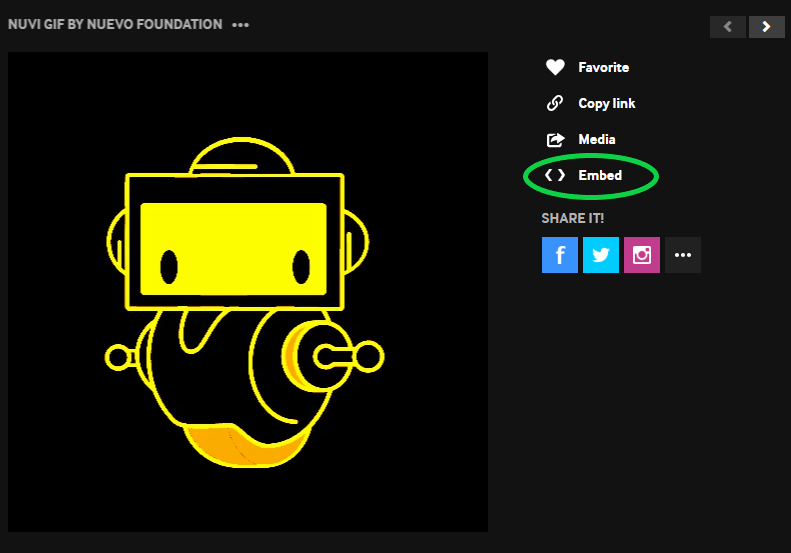
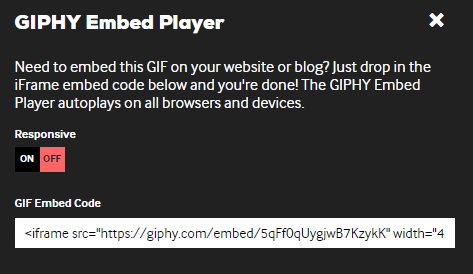

{}

1. <a href="https://giphy.com/nuevofoundation" target="_blank">Follow this link</a> to see the available GIFs
2. Click on the one you like and select "Embed"  
    
3. Copy the code from the white box below "GIF Embed Code" 
    
4. Paste the code anywhere in your page as long as it's inside the <code>&lt;body&gt;</code> tags.  
    
<a class="my-2 mx-4 btn btn-info" href="https://codepen.io/Sunny-Dee/pen/moqzmP" target="_blank">Try it yourself!</a>

{}
