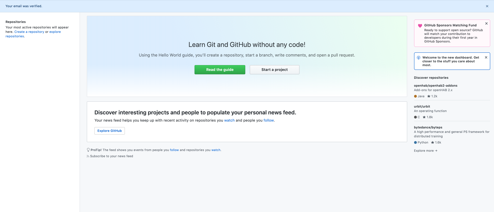

{}

You will need a GitHub account to do so. If you don't have one, create one [here](https://github.com/).

{}

Once you have created your account and verified your email address, you will land on this page.

