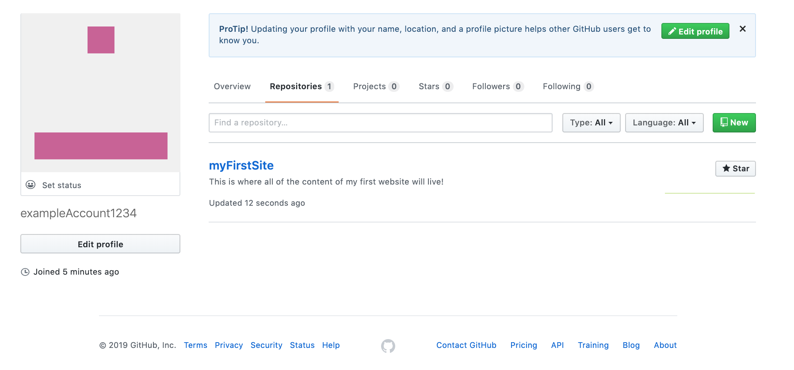

{}

Now, you will need to create a new repository to store the contents of your site! Think of a repository as a giant folder that can store lots of other files and folders for a given project. You can create one by selecting 'Start a Project' or 'Create a new repository'. Two very important things to keep in mind:

1. Name your repo <b>without any spaces</b>. But you can use dashes or capitalization to replicate spaces!
2. <b>Check the box 'Initialize this repository with a README'</b>

{}

<b>Congratulations!</b> You have created your first repo! 

