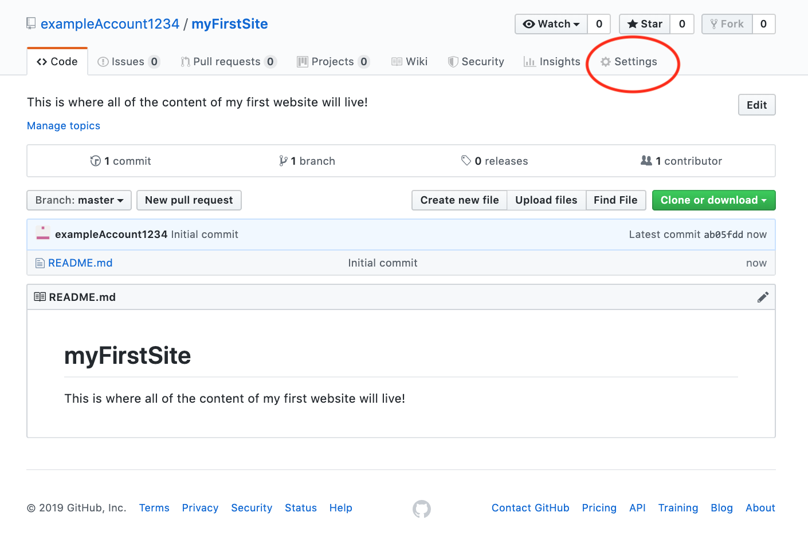
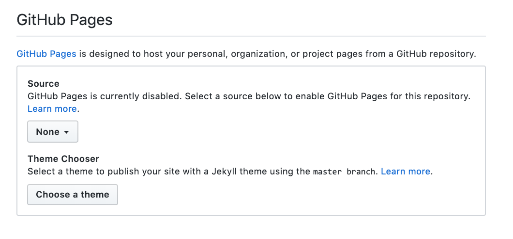
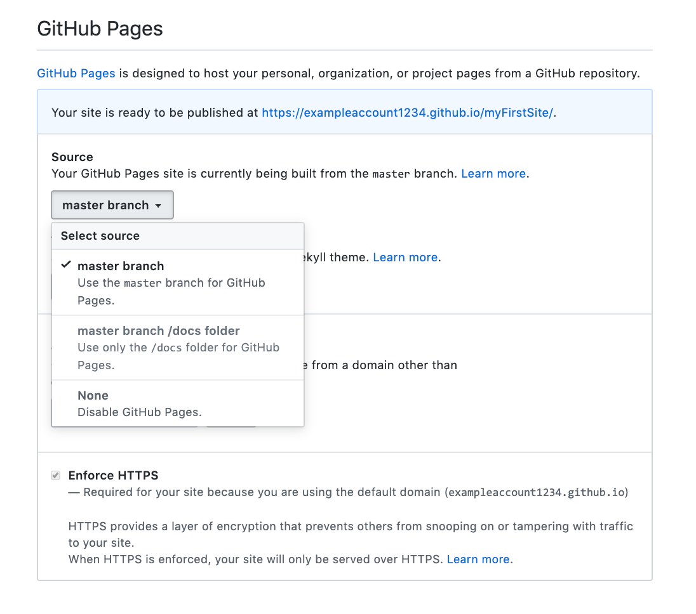

{}

After you've uploaded everything you created for your site, navigate back to the repo and select Settings. Locate the `Github Pages Section`

{}

Scroll all the way down to the GitHub Pages section. 

{}

Change the <b>Source</b> from 'None' to 'master branch'. Save these changes and click the link at the top of the GitHub Pages section (in the example below, it would be https://exampleaccount1234.github.io/myFirstSite/). Now anyone can access your site with this link!

{}

