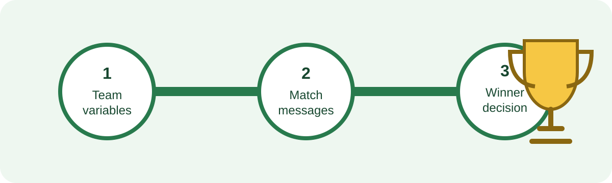

## Your championship mission

Nuvi United has reached the final match of an imaginary world soccer championship. The stadium is full, the scorekeeper is ready, and the team needs **you** to build a Python match program.

Across three activities, your program will introduce the teams, display match updates, and decide who lifts the cup. You can personalize the team, captain, colors, opponent, and score.



{}
This is a fictional coding story. It does not use official tournament teams, logos, or results.
{}

## What you will learn

By the final whistle, you will be able to:

- create variables that remember team information and scores;
- use formatted strings to build match announcements; and
- use an `if`/`else` decision to choose a winner message.

## What you need

- Python 3 installed on your computer
- A text editor, such as Visual Studio Code, IDLE, or Notepad
- About 45 minutes

You should already know how to save a file and run a simple Python program. No online account or external coding service is required.

Because you already have some exposure to Python, Activity 1 is a quick refresher rather than a first introduction to coding. It reviews variables so everyone starts with the same team data before Activity 2 uses those variables in formatted match messages and Activity 3 compares the score variables to decide the winner.

## Create your match file

1. Open your text editor.
2. Create a file named `world_cup_2026.py`.
3. Save it somewhere easy to find.
4. Open a terminal in that folder.
5. Run the program after each change:

```text
python world_cup_2026.py
```

On some computers, the command is `python3 world_cup_2026.py`.

{}
For an in-person workshop, work beside a teammate. After each activity, trade places: one person runs the code while the other checks the match announcement.
{}

## Table of Contents

<details>
<summary>Table of Contents</summary>
{}
</details>
