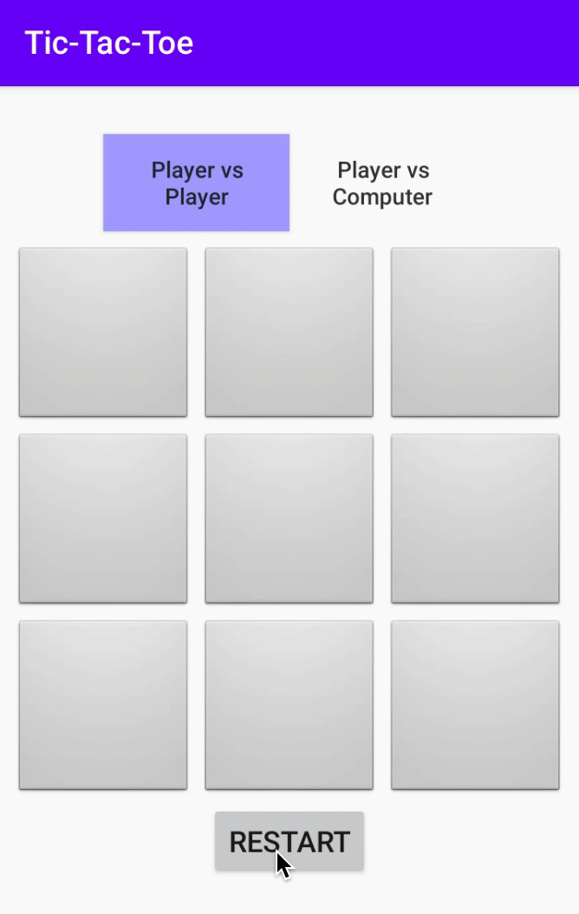

## Comienza tu aventura de juego para Android

¿Alguna vez te has preguntado cómo podrías construir tu propio juego de Gato?

¡Estas de suerte, hoy es el día, podrás construir el tuyo!

## ¡Vamos a comenzar!

## ¿Qué es Android?

¡Android es actualmente el sistema operativo móvil más utilizado en el mundo! Android Studio te permite crear aplicaciones que pueden usar estos dispositivos Android. De hecho, si tienes un teléfono Android, ¡incluso puedes descargar la aplicación que estás haciendo hoy en tu teléfono!

## Acerca de este Proyecto

En este proyecto te hemos dado una aplicación Android que funciona principalmente que es un juego de Tic-Tac-Toe. ¡Necesita tu ayuda para solucionar algunos problemas y agregar algunas partes para que sea un gran juego!

## Descarga los archivos del proyecto

Para comenzar, descargue los archivos del proyecto siguiendo estos pasos:
1. [Descarga los archivos de proyecto](../resources/_gen/files/TicTacToe.zip) para tu juego.
2. Busque el archivo TicTacToe.zip en su carpeta de descargas.
3. Descomprima el archivo.
   - En Windows: Haga clic derecho en TicTacToe.zip y seleccione `Extraer todo...`. Se creará una carpeta llamada `TicTacToe` que contiene el código del proyecto.

¡En esta aventura, tendrás que resolver los rompecabezas marcados con etiquetas `PUZZLE` para completar el juego!

## Tabla de contenidos

Tabla de contenidos

{}

