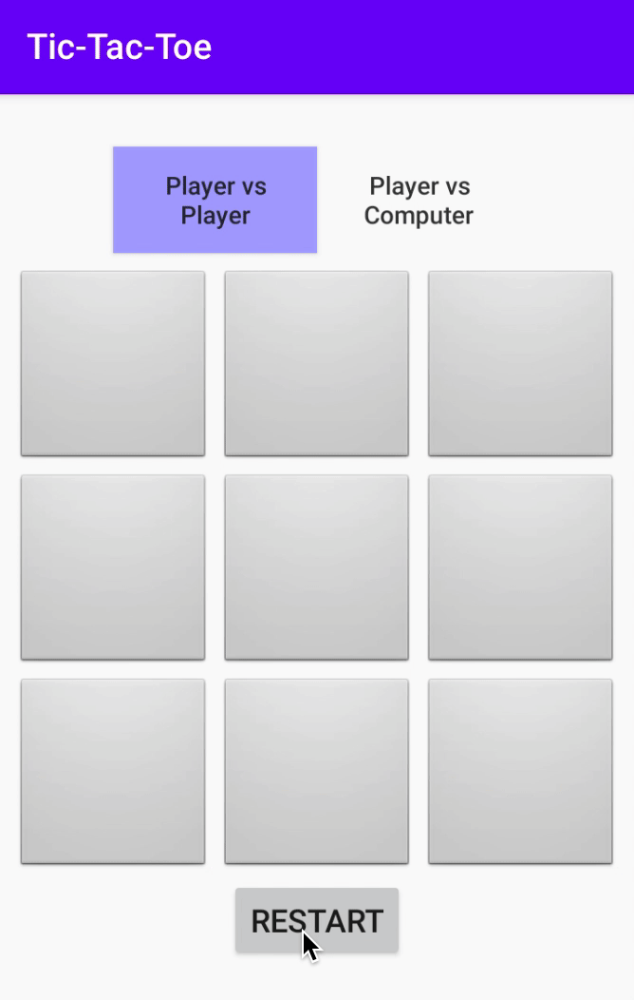

## Comienza tu Aventura de Juegos en Android

¿Alguna vez te has preguntado cómo podrías construir tu propio Tic-Tac-Toe? 

¡Estás de suerte! Hoy es el día en el que construirás el tuyo propio.

## Primeros Pasos

## ¿Qué es Android?

¡Android es actualmente el sistema operativo móvil más utilizado en el mundo! Android Studio te permite crear aplicaciones que pueden ser utilizadas en estos dispositivos Android. De hecho, si tienes un teléfono Android, ¡podrás descargar la aplicación que estás creando hoy en tu propio teléfono!

## Acerca de este Proyecto

En este proyecto te hemos proporcionado una aplicación para Android que es principalmente funcional y consiste en un juego de Tic-Tac-Toe. ¡Necesita tu ayuda para solucionar algunos problemas y agregar algunas partes para que sea un juego increíble!

## Descarga los Archivos del Proyecto

Para comenzar, descarga los archivos del proyecto siguiendo los pasos a continuación:
1. [Descarga los archivos del proyecto](resources/_gen/files/TicTacToe.zip) para tu juego.
2. Localiza el archivo TicTacToe.zip en tu carpeta de descargas.
3. Descomprime el archivo.
   - En Windows: Haz clic derecho sobre TicTacToe.zip y selecciona `Extraer todo...`. Se creará una carpeta llamada 'TicTacToe' que contiene el código del proyecto.

En esta aventura, ¡necesitarás resolver los enigmas marcados con etiquetas `PUZZLE` para completar el juego!

## Tabla de Contenidos

Tabla de Contenidos

{}

