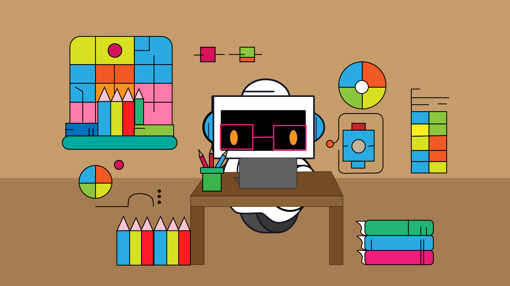
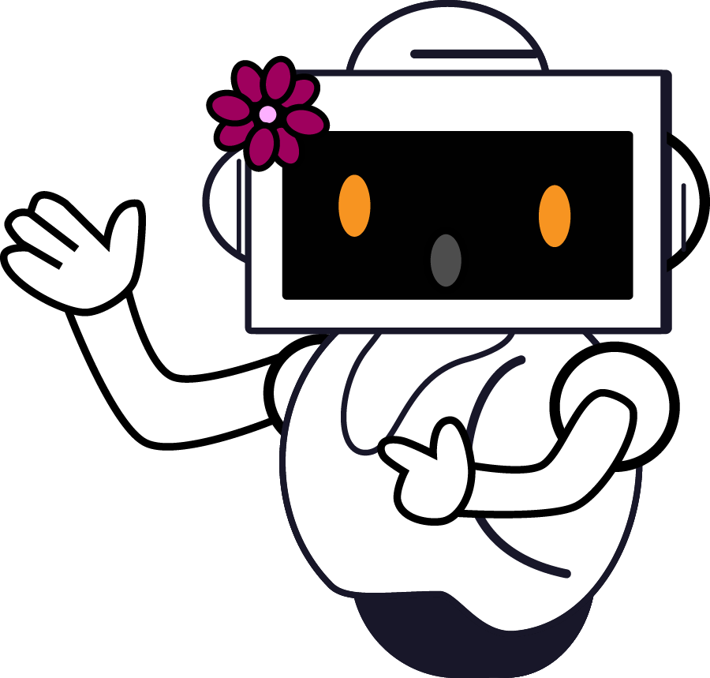
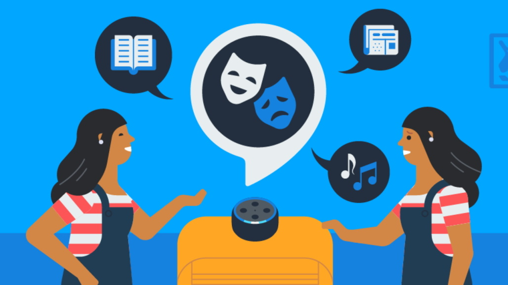
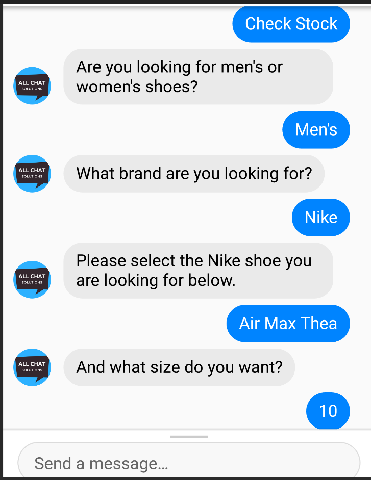
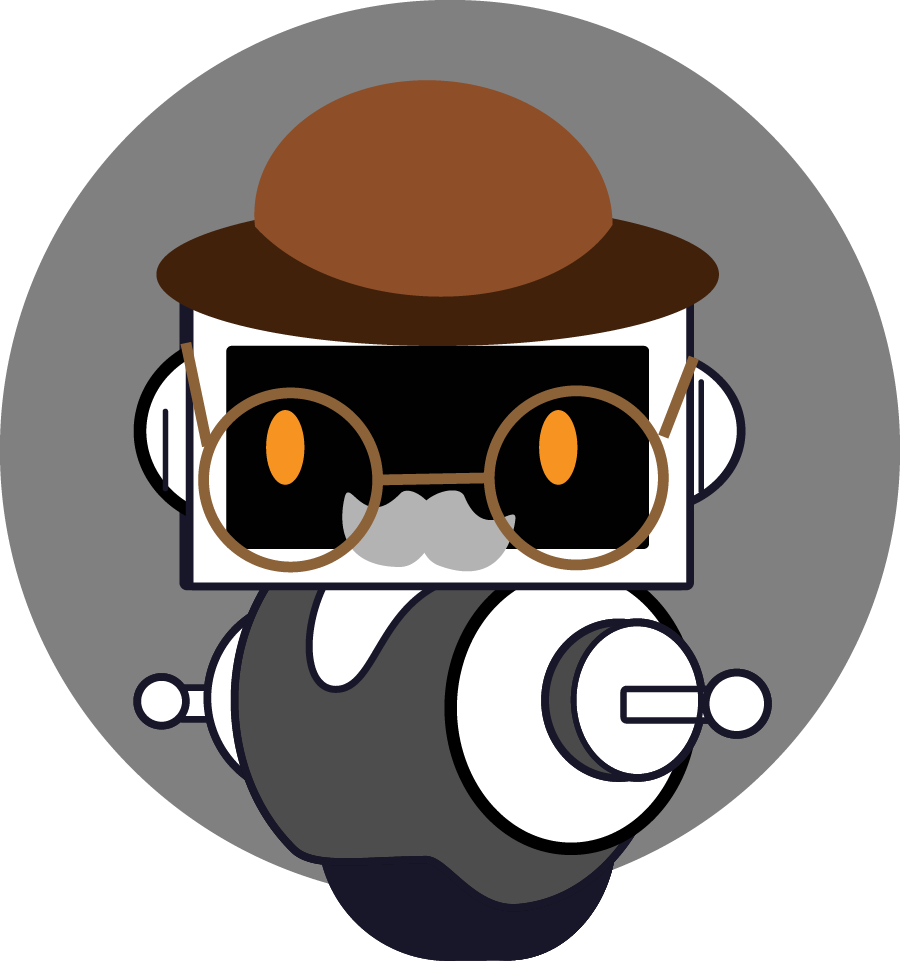

## Introducción
En este taller aprenderás a crear tu propio chatbot. Al final del taller tendrás un chatbot capaz de mantener una conversación sencilla con la persona que lo use. Aprenderás a usar AIML, un lenguaje para crear chatbots. También aprenderás a usar Pandorabots, una plataforma para alojar chatbots.

Para completar el taller necesitarás una dirección de correo electrónico con la que registrarte en Pandorabots.

## ¿Qué es un chatbot?
Un chatbot es un programa de computadora que simula una conversación humana para responder preguntas. 

## Ejemplos de chatbots
Es muy probable que ya hayas interactuado con un chatbot en tu vida diaria. 

Puede que uses un asistente virtual para programar un recordatorio en tu teléfono o para poner una canción en tu altavoz inteligente.

También puede que hayas hablado con un chatbot para obtener ayuda con un producto o servicio.

Más recientemente, los chatbots se han hecho más conocidos gracias a tecnologías como ChatGPT.

## Historia de los chatbots
Los chatbots existen desde hace mucho tiempo. El primer chatbot se creó en 1966 y se llamaba ELIZA. En 1995 se creó un nuevo chatbot llamado ALICE. ALICE se escribió usando AIML, el mismo lenguaje que aprenderemos en este taller.

## Secciones

Secciones

{}

