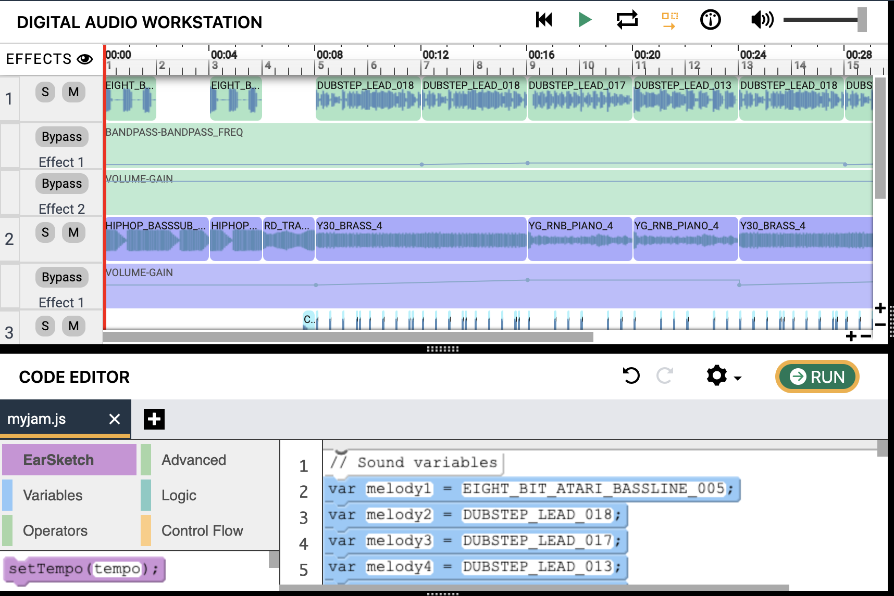

--- 
title: "Bloques: Crea música con EarSketch"
description: "Crea música usando bloques de JavaScript y EarSketch"
date: 2019-07-23T11:45:38-07:00
difficulty: "Principiante"
download: ""
draft: false
icon: "fab fa-puzzle-piece"
---

### ¡Vamos a hacer música!

Bienvenido a esta guía introductoria sobre cómo hacer música usando [EarSketch](https://en.wikipedia.org/wiki/EarSketch). 

### Conoce a DJ Nuvi

### ¡Nuvi tiene unos nuevos auriculares! ¿Puedes encontrar los tuyos?

Te contactaron para hacer el próximo éxito de mixtape de Nuvi, pero cuando llegas al estudio, Nuvi dice que su próximo proyecto va a ser producido con código. Esto es algo que no se ha hecho antes; ¿estás preparado para el desafío? ¡Busca tus auriculares y prepárate para unirte a él!

Antes de empezar, asegúrate de que tus auriculares funcionan. Prueba a reproducir el siguiente audio. ¿Qué escuchas?

<figure>
    <audio
        controls
        src="./audio/good-enough.mp3">
            Audio de prueba para ver si tu navegador soporta el elemento de audio. Si no puedes reproducir el audio, probablemente significa que tu navegador no soporta este elemento de <code>audio</code>.
    </audio>
</figure>

## Ventana general de EarSketch

## Tabla de contenidos

Tabla de contenidos

{}

