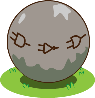

## Introducción

Bienvenidos al **Bosque Mágico Digital**.
Aquí viven animales muy especiales: la **Rana**, el **Tucán**, el **Perezoso** y el **Monito**. 

Ellos protegen una **esfera mágica** que mantiene el bosque lleno de vida y luz.  
Pero algo ha pasado... la esfera se está apagando, y solo podrá encenderse de nuevo si **resolvemos acertijos usando compuertas lógicas**.  

¿Te animas a ayudarlos?

---

## ¿Listo para comenzar?

Haz clic en la primera sección para iniciar la aventura con nuestros amigos del bosque.

---

## Contenido

Secciones

{}

