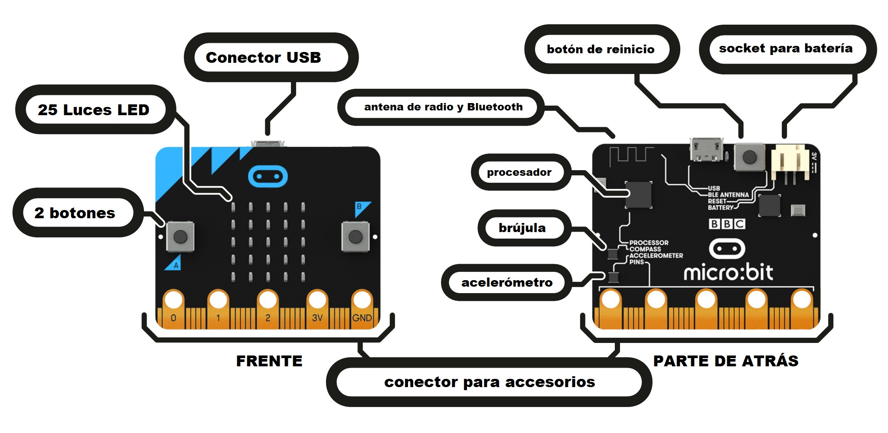
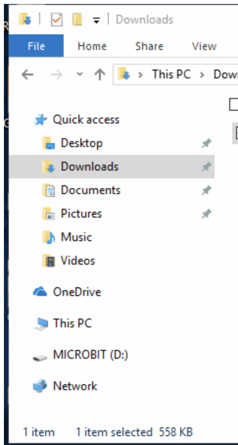
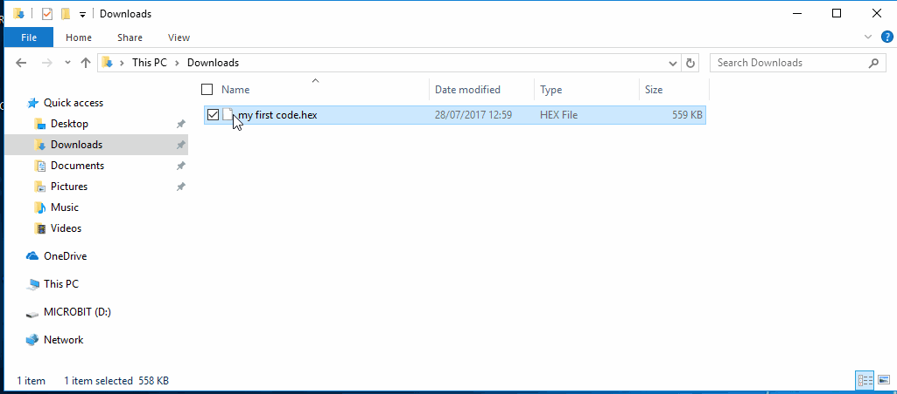

### Una introducción a JavaScript y hardware mediante [Micro:Bits](https://microbit.org/guide/)

[logo]: https://media.giphy.com/media/1nOL7s74KmSk0zDlDD/giphy.gif

![alt text][logo]

# Lo básico

## ¿Qué es JavaScript?

JavaScript es uno de los muchos lenguajes de programación y se conoce como el lenguaje de programación para la web. Se utiliza para controlar el comportamiento de la página web como clics de botón, ventanas emergentes, flujos de datos y muchas otras funciones.

## Variables

Las variables son contenedores en el código que pueden contener un solo número, palabra u otra información. Esta información se puede utilizar y cambiar llamando la variable más adelante en el programa. Esto significa que puedes solicitar a tu programa que acceda a la información que has almacenado.

Con algunas excepciones, las variables se pueden identificar con cualquier letra, dígito, ora inferior o signo de dólar. PERO pase lo que pase, no pueden tener espacios y siempre deben empezar con una letra.

Las variables pueden contener diferentes tipos de datos.  Vamos a repasar lo básico.


## Tipos de Datos

### Números Enteros

Un número entero es básicamente sólo un nombre elegante para cualquier número que no es un decimal. Por ejemplo, los números enteros son números como 3, 100, 6,000, -3, ¡y más!

```javascript
// Este es un comentario.  Estos se utilizan para describir lo que hace tu código.
// A continuación se muestran diferentes ejemplos de variables.

// Ejemplos de variables enteras (no decimales):

var a = 5;
var b = 10;
var c = 15;
```

### Dobles

Los dobles son los otros números que tienen un punto decimal.  Ejemplos son números como 0.5, 1.5, ¡y más!

```javascript
// Ejemplos de variables dobles (números decimales):

var x = 0.5;
var y = 1.5;
var z = 2.0;
```

### Cadenas

Las cadenas son variables que pueden almacenar palabras.  Si te ayuda a recordar que las cadenas son palabras, considérelos como una "cadena" de caracteres. Las cadenas pueden ser cualquier cosa como tu nombre o el nombre de tu mascota favorita.

Las cadenas están rodeadas por comillas.

```javascript
// Ejemplos de Cadenas (una o más palabras también conocidas como "cadena" de caracteres):
// Los valores de las variables de cadena están rodeados por comillas

var compania = "MICROSOFT";
var curso = "Codificar es divertido!";
var mensaje = "Codificar es divertido!";
```

### Caracteres

Los caracteres son letras individuales. Están rodeados por comillas.

```javascript
// Ejemplo de variable de carácter (una sola letra):
// los valores de las variables de carácter están rodeados por comillas.

var letter = "A";
```

### Booleanos

A veces los programadores quieren comprobar si ciertas condiciones son verdaderas o falsas. Esta información se almacena en un dato tipo booleano.

Si tienes curiosidad acerca de por qué se llaman booleanos, un tipo llamado George Boole es el que los creó.

```javascript
// Un variable booleano puede ser verdadero (true) o falso (false).

var puedenVolarLosCerdos = false;
var codificarEsPadre = true;
```

## Operaciones matemáticas

¡Ah sí! Las computadoras son esencialmente calculadoras por lo que debe ser un hecho que podemos hacer matemáticas en ellas. Aquí hay ejemplos de las matemáticas que puedes hacer en tus programas de JavaScript.

### Suma

```javascript
var a = a + b;                //a = 15
var a += b;                   //a = 25
```

### Resta

```javascript
var a = a - b;                //a = 15
var a -= b;                   //a = 5
```

### Multiplicación

```javascript
var a = a * b;                //a = 50
var a *= b;                   //a = 500
```

### División

```javascript
var a = a / b;                //a = 50
var a /= b;                   //a = 5
```

### Módulo

Ah sí, puede sonar aterrador pero en realidad no lo es. Las operaciones de módulo sólo te dan el residuo después de la división. Por ejemplo, 10 % 2 da 0 porque cuando se divide 10 por 2, no le queda ningún residuo.

```javascript
var d = 10 % 2; //d= 0
var e = 5 % 2; //e= 1
```

### Declaraciones impresas

A veces deseas que tu computadora muestre realmente el texto o los datas que contienen las variables. Para ello utilizamos instrucciones de impresión.

```javascript
console.log("Esto aparecerá en la consola, pero no en la página web");
alert("Esto se mostrará como una ventana emergente");

var respuestaDelUsario = prompt("¿Quieres jugar un juego?");
```

### Sentencias Condicionales y Operadores Lógicos

Las sentencias condicionales más comúnmente llamadas “if statements” se utilizan para elegir qué código ejecutar dependiendo del valor de las variables u otras condiciones.

```javascript
// Sentencias Condicionales
if (true) {
   // esta sección de código se ejecutará porque la expresión es cierta (true)
}
if (false) {
   //esta sección de código no se ejecutará porque la expresión es falsa (false)
}

var edad = 10;
if (edad < 18) {
  // si el valor de la variable “edad” es menos que 18
  print("Usted no es un adulto todavía! :( ");
}
```

### Bucles

Y por último, pero no menos importante tenemos cosas llamadas bucles. Esto te permite repetir partes del código hasta que se cumpla una determinada condición.
La función “alert()” que se ve en el código a continuación produce una ventana emergente que te muestra el parámetro que le pasas.  El parámetro es lo que está entre paréntesis.  En este caso está mostrando el valor de la cuenta actualizada.

```javascript
// Este bucle “while” cuenta hacia abajo desde 10
var cuenta = 10;

while (cuenta > 0) {
  alert(cuenta);
  cuenta--;
}

// Este bucle “for” cuenta hacia abajo desde 10.
for (var i = 10; i > 0; i--) {
  alert(i);
}

// Este es un bucle “while” sin fin o un bucle “while” infinito.
while (true) {
  // Esta parte del código se ejecutará una y otra vez para siempre ya que la condición nunca será falsa.
  // Cierto (true) siempre es cierto (true).
}

// ”break” rompe un bucle inmediatamente y se mueve a la línea siguiente del bucle
while (true) {
  break;
}
// El programa se sale del bucle después del “break” y sigue ejecutando en esta línea.
```

## Comenzando con Micro:Bit

Ahora que conoces los conceptos básicos de JavaScript, ¡puedes usar tus habilidades de conocimiento para empezar a programar tu Micro:Bit!

### ¿Qué es un Micro:Bit?

Un Micro:Bit es una mini computadora programable! Se puede codificar desde cualquier navegador web en varios lenguajes de programación como JavaScript, Python, Scratch y Block. Para nuestra sesión de hoy vamos a utilizar JavaScript.

Tu Micro:Bit tiene las siguientes características físicas:

- 25 LEDs programables individualmente
- 2 botones programables
- Pines de conexión física
- Sensores de movimiento (acelerómetro y brújula)
- Comunicación inalámbrica a través de bluetooth y radio
- Interfaz USB



Si deseas aprender más acerca de cada componente individual y todas las características que vienen con tu Micro:Bit puedes hacer clic [aquí](https://microbit.org/guide/features/).

Ve y saca el Micro:Bit y el resto de los componentes de la bolsa. Debes tener un Micro:Bit, 2 baterías, un cable micro USB, y el soporte de la batería (la caja negra con los cables rojos y negros que salen de ella). Si te falta algo o necesitas ayuda, ¡no dudes en preguntar a uno de los instructores!

### Inicio rápido

Continúa y conecta tu Micro:Bit a tu computadora usando el cable USB. No necesitarás las baterías por un tiempo entonces puedas dejarlas a un lado.

Una vez que conectes el Micro:Bit a tu computadora, se mostrará en tu computadora como una unidad llamada 'MICROBIT'. Si abres el explorador de archivos, deberías ver algo similar a la imagen de abajo.



¡He codificado un juego para darte un ejemplo de lo que puedes hacer! Sigue adelante y descarga mi juego haciendo clic en la siguiente liga.

<a href = "resources/files/microbit-Asteroids.hex" download>Haz aquí clic para descargar</a>

Una vez que se descarga, deberás mirar el archivo ‘HEX’ dentro de tu carpeta de Descargas (o ‘Downloads’). (También notarás que he nombrado este juego 'Asteroides.'  Si tienes un nombre mejor por favor hazme saber.)

Para jugar el juego tendrás que copiar este archivo a tu Micro:Bit. Para ello puedes simplemente copiar y pegar el archivo en el directorio de Micro:Bit pero encontré otro método mucho más fácil. Simplemente haz clic con el botón derecho en el archivo y luego haz clic en **Enviar A** (o **Sent To**) y luego selecciona **MICROBIT**



Si lo hiciste correctamente, notarás que los LEDs de tu Micro:Bit se detendrán durante un rato y el LED amarillo de la parte de atrás parpadea mientras el Micro:Bit descarga el código. Si no ves esto, no te preocupes y pídenos ayuda.

¿Tienes curiosidad por saber cómo es el código de mi juego? Haz clic [aquí](https://makecode.microbit.org/_bhJYfUURARgx)

### Protege tu nave espacial


¿Listo para jugar? Esta es la lista de controles:

- **A + B:** Dispara láseres para destruir asteroides entrantes
- **Tilt:** Inclina tu Micro:Bit hacia la izquierda o la derecha para mover tu nave espacial

Simple ¿verdad? Ya veremos. He programado este juego para ir más rápido cuanto más asteroides destruyas. ¿Crees que tienes el puntaje más alto? ¡Presume y haz nos lo saber! Puedes ver tus puntos cuando la pantalla de “game over” termine.

**CONSEJO:** Si llegas a la pantalla de “game over” y quieres iniciar un nuevo juego, simplemente haz clic en el botón de reinicio detrás de tu Micro:Bit.

### Empezar a codificar

¡Finalmente! ¡Aquí está la mejor parte! ¡Ahora puedes usar todo lo que has aprendido para crear tus propios programas y codificar tu Micro:Bit!

En primer lugar, vamos a mostrar nuestro nombre en el Micro:Bit. Continua conmigo.

¡Ahora vamos a repasar dos tutoriales juntos! Ve a esta [liga](https://makecode.microbit.org/) y encuentre el tutorial "Flashing Heart."

Vamos a ir a través de esto y los tutoriales de "Micro Chat."

### Tu turno

Avanza y encuentra otro tutorial en el que estés interesado. Si te sientes seguro, codifica tu propio programa desde el comienzo. ¡Diviértete!

### Recursos y Hoja de Trucos Avanzados de Micro:Bit

#### Variables, Impresión y Descarga

- Las variables de JavaScript son las mismas, excepto que se utiliza la palabra clave 'let' en lugar de ‘var’ para definir un variable.

  ```javascript
  let variable = "texto";
  ```

- El comando `basic.showString(variable);` hará que el texto aparezca en el LED del Micro:Bit

  ```javascript
  let nombre = "Gonzo";
  basic.showString(nombre);
  ```

### Comandos útiles de JavaScript

Los siguientes comandos están en JavaScript, si prefieres usar el equivalente en código Block simplemente busca en la biblioteca correspondiente. Por ejemplo, puedes encontrar la función ‘basic.forever()’ haciendo clic en la pestaña ‘Basic’ y arrastrando la función ‘forever’ a tu pantalla.

```javascript
basic.forever(function() {
  // El código entre estos corchetes se ejecutará para siempre en tu Micro:Bit.
});

// Muestra el número dentro de los paréntesis en tu Micro:Bit
basic.showNumber(number);

// Muestra la cadena (palabra) dentro de los paréntesis en tu Micro:Bit
basic.showString(string);

// Genera un número aleatorio entre 0 y el número dentro de los paréntesis
Math.random(number);

input.onButtonPressed(Button.A, function() {
  // El código aquí se ejecuta cuando se hace clic el botón que especifiques.
  // En este caso cuando se presiona el botón A.
});

// Muestra el caractér especificado en la pantalla LED
basic.showIcon(IconNames.Character);

// Pausa a tu Micro:Bit por la cantidad especificada de microsegundos
basic.pause(microseconds);

```
