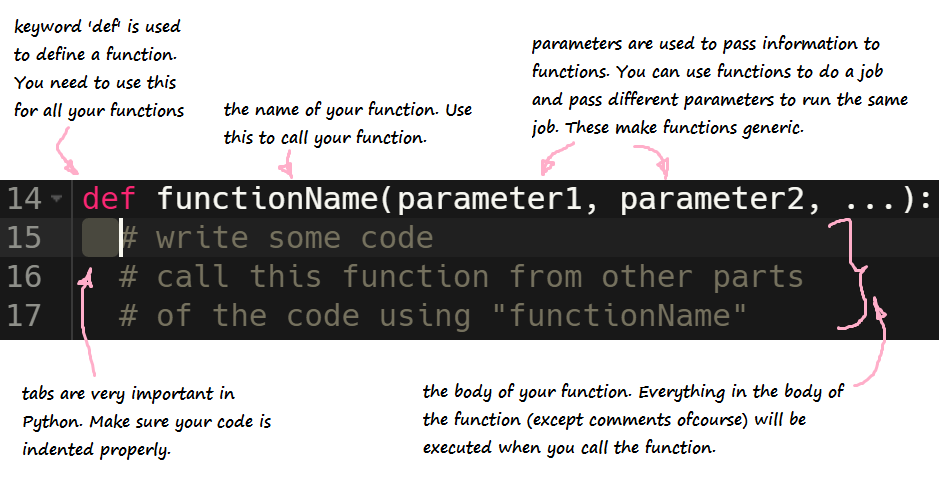

<iframe width="560" height="315" src="https://www.youtube.com/embed/0207zoiJ6s8" frameborder="0" allow="accelerometer; autoplay; encrypted-media; gyroscope; picture-in-picture" allowfullscreen></iframe>

**Funciones** son una forma de organizar fragmentos de código similares o repetitivos. En lugar de tener que escribir constantemente el mismo código, podemos poner el código deseado en una función y llamarla cuando queramos usarlo.

{}
**Nota:** El propósito de una función es ayudar a reducir el código redundante a lo largo del programa.
{}

## Crear una Función

### Definir tu Función - Nombre y Parámetros

Para crear una función en Python, debemos usar la palabra clave `def`. Esta palabra clave indica al editor de código dónde se define la función. `def` va seguida del nombre de la función. El nombre de la función se usa para llamar a tu función desde otras partes del programa.
Para generalizar la función (para poder usarla en varios lugares), puede que necesitemos enviarle alguna información. Esto se logra usando parámetros. Se colocan entre paréntesis `()` y van justo después del nombre de la función. Si no se necesitan parámetros, se pueden omitir. La declaración de la función termina con dos puntos.
Las sentencias que se ejecutan cada vez que se llama a la función siguen en las líneas siguientes. La sangría es muy importante aquí, así que asegúrate de que tu código esté correctamente indentado. Cada línea indentada después de la línea de definición de la función (con la excepción de los comentarios) se ejecutará cuando llames a la función.

Here's what a function looks like:

```python
def nombreDeLaFuncion(parametro1, parametro2, ...):
    # escribe algún código
    # llama a esta función desde otras partes
    # del código usando nombreDeLaFuncion
```


{}
Asegúrate de que la primera línea de tu función siempre termine con dos puntos `:`
{}

### Escribir el Cuerpo de la Función

En Python, la indentación define qué código está controlado por la función. En el ejemplo de abajo, para llamar a la función `sectionA`, debes especificar 2 parámetros, `startMeasure` y `endMeasure`. Cuando llamas a `sectionA`, se ejecutan las 3 líneas de la función `fitMedia`. Las 2 llamadas a `fitMedia` de abajo están fuera del cuerpo de la función `sectionA`.

```python
# Sección A
def sectionA(startMeasure, endMeasure):
    fitMedia(RD_UK_HOUSE__AIRYPAD_1, 1, startMeasure, endMeasure)
    fitMedia(HOUSE_MAIN_BEAT_002, 4, startMeasure, endMeasure)
    fitMedia(HOUSE_ROADS_BASS_001, 5, startMeasure, endMeasure)

 fitMedia(HOUSE_DEEP_CRYSTALCHORD_001, 3, 1, 5)
 fitMedia(HOUSE_DEEP_CRYSTALCHORD_002, 3, 5, 9)   
```

El código que está indentado debajo de la función `sectionA` es el código que se ejecuta cada vez que se llama a la función `sectionA`.

{}
**Advertencia:** Dado que la indentación es muy importante en Python, asegúrate de que el cuerpo de la función siempre comience con 2 espacios.
{}

## Devolver un Valor
Muchas veces no quieres solo imprimir los resultados o realizar una acción, sino que quieres que la función te devuelva el resultado de realizar la acción. Para hacer esto, usas la palabra clave `return`.

```python
def mi_funcion(x):
    return 5 * x

print(mi_funcion(3)) # imprime 15
print(mi_funcion(5)) # imprime 25
```

## Usar la Función - Llamada a la Función

Para llamar a una función, introduce el nombre de la función y sus parámetros donde quieras ejecutar la función. Por ejemplo, para llamar a la función `sectionA`, haríamos algo así:

```python
sectionA(1,9)
```

En este ejemplo, `sectionA` será llamada con el valor `startMeasure` como `1` y el valor `endMeasure` como `9`.

{}
**Ten cuidado:** Cuando crees una función en Python, debes definir la función y su contenido antes de que sea llamada. En otras palabras, en el código necesitas poner la declaración de la función por encima de la llamada a la función. De lo contrario, recibirás un NameError como el que se muestra abajo. Mira la figura siguiente para un ejemplo:

{}

### Desafío 1 - ¡Crea tu propia función!

**Desafío:** Crea una función llamada addNumbers que tome 2 parámetros llamados number1 y number2 e imprima la suma en la consola. Llama a la función addNumbers con los parámetros 3 y 5.
¿Qué se imprime en la consola?

<iframe src="https://trinket.io/embed/python/31164cfda3e0" width="100%" height="600" frameborder="0" marginwidth="0" marginheight="0" allowfullscreen></iframe>

### Desafío 2

Intentemos crear algunas funciones matemáticas simples. Crea una función llamada add que reciba dos parámetros, numero1 y numero2, y devuelva la suma de los dos números.

{}

Primero copia la estructura de la función triple. Cambia el nombre de la función, y reemplaza el parámetro número por numero1 y numero2, separados por una coma. Tanto numero1 como numero2 deben ser <font color="blue">int</font>, y no olvides sumar numero1 y numero2 juntos.

{}

Para comprobar que tu función funciona correctamente, añade el siguiente código después de la definición de tu función, que llama a la función add() y guarda su valor en una variable. Por ejemplo:

<pre>
value2 = add(2, 3)
<font color="blue">print</font>("Esto debería imprimir 5: " + str(value2))
</pre>

### Desafío 3

¿Puedes crear funciones para resta, multiplicación y división?

Prueba las funciones llamando a cada una, guardando su valor de retorno y luego imprimiéndolo en la consola. 