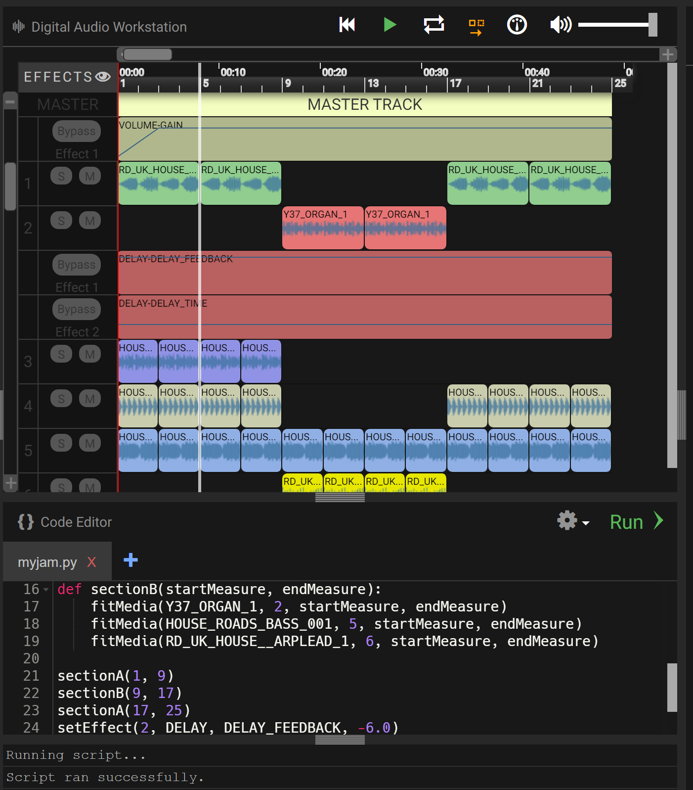

### Hagamos algo de música!

Bienvenidos a esta guía introductoria sobre cómo crear música usando [EarSketch](https://en.wikipedia.org/wiki/EarSketch) y Python. 

Para ir a alguna actividad específica, puedes darle click a cualquier sección en el menu a la izquierda de esta página.

### Conoce a DJ Nuvi

## ¡Nuvi tiene sus audífonos! ¿Puedes encontrar los tuyos?

Te estamos contactando para crear el próximo éxito de Nuvi, pero cuando llegas al estudio, Nuvi dice que su próximo proyecto se va a producir todo en código. Esto es algo que no se ha hecho antes, ¿estás listo para el desafío? ¡Mira a tu alrededor para encontrar tus audífonos y prepárate para unirte a él!

Antes de empezar, debemos comprobar si tus audífonos están funcionando. Intenta reproducir el siguiente audio. ¿Qué oyes?

<figure>
    <audio
        controls
        src="../audio/good-enough.mp3">
            Verifica tu audio para ver si tu browser/navegador tiene soporte para audio. Sino suena, entonces es probable que necesites usar otro browser/navegador de internet como Google Chrome. 
            <code>audio</code> element.
    </audio>
</figure>

## Pantalla de EarSketch que usaremos para este taller

## Secciones

Secciones

{}

