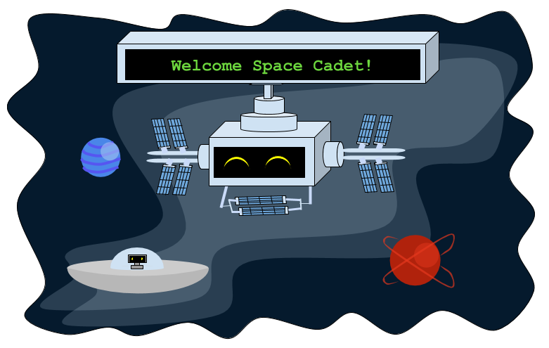

<!-- Link to sql image drive: https://drive.google.com/drive/folders/0ADAbCQbzZCAFUk9PVA -->

<iframe width="560" height="315" src="https://www.youtube.com/embed/oFfaxcxBkUQ" title="YouTube video player" frameborder="0" allow="accelerometer; autoplay; clipboard-write; encrypted-media; gyroscope; picture-in-picture" allowfullscreen></iframe>

# Introducción: Aprende SQL salvando la Galaxia!

## Bienvenido a la Estación Espacial de Nuevo! 

Eres un aventurero espacial que viaja a través de la galaxia en tu cohete mientras resuelves acertijos de código para ayudar a salvar a tus amigos aliens en distintos planetas.

¡Haz sido elegido como un explorador espacial honorario por la Federación Galáctica! Se te darán misiones para ayudar hacer la galaxia un lugar seguro y divertido para todos.
 

{}
Por favor, no uses el navegador Firefox para este taller.
{}

## Contenido

{}
