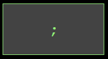

<!-- Links for javascript and CSS needed for drop down logic -->
<link rel="stylesheet" href="../default/_default.css" type="text/css"></link>
<link rel="stylesheet" href="../default/_type.css" type="text/css"></link>
<link rel="stylesheet" href="_activity1.css" type="text/css"></link>

<iframe width="560" height="315" src="https://www.youtube.com/embed/hUTKI3AHJ1s" title="YouTube video player" frameborder="0" allow="accelerometer; autoplay; clipboard-write; encrypted-media; gyroscope; picture-in-picture" allowfullscreen></iframe>

# Misión 1: ¡Salvar al Planeta de la Diversión del Aburrimiento! 
¡Tu primera misión es ir al Planeta de la Diversión y salvarlo del aburrimiento! Te han enviado una base de datos sobre el planeta y necesitas aprender como usar los comandos SQL para ayudar a salvar el Planeta de la Diversión. 

## Tarea 1: Echa un vistazo a la información sobre el Planeta de la Diversión
Te han dado información sobre la Galaxia y quieres buscar al Planeta de la Diversión. Para hacer esto, la Federación Galáctica te ha dado tu primer comando SQL:`SELECT`. 

{}
### Lo que hace el comando:  
El comando `SELECT` te permite elegir cuáles datos mostrar de la base de datos. 
{}

### Ejemplo:

### ¡Ahora usa lo que aprendiste! 
{}
**¡Arrastra los bloques a la terminal y reacomodalos para responder la siguiente pregunta!**
{}

#### Pregunta: ¿Cuál comando muestra todas las columnas en la base datos llamadas "galaxy"?



<!-- Rectangles to Receive blocks -->

 

 

 

 

 

 

 

  <!-- style="border: 1px solid green;"> -->

  

  

  

  

 

<!-- Enter button -->
<button class="button button1" onclick="check()">Enter</button>

 <!-- terminal_div -->

 <!-- content_scaler -->

<!-- Hidden SQL database will appear once correct sequence is placed -->

 
<h1 class="error" id="sqlcommand" style="visibility:hidden"><strong>ERROR INVALID INPUT</strong></h1>
<table id="table">
  <tr></tr>
</table>

<!-- Tells User to continue mission -->

  
 ¡Encontraste el comando correcto para mostrar la base de datos completa! Esto es es útil cuando quieres ver toda la información al alcance de tus dedos.

  

    &#10003;
    Haz completado la tarea. Continua a la siguiente misión.
  


