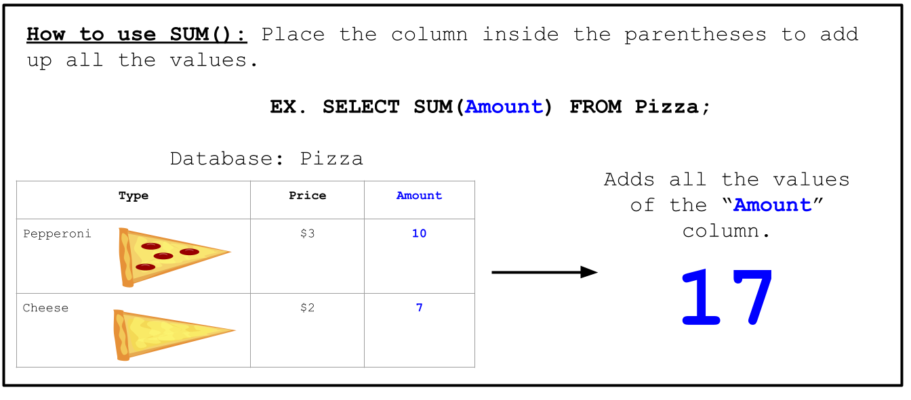

<!-- Links for javascript and CSS needed for drop down logic -->
<link rel="stylesheet" href="../default/_default.css" type="text/css"></link>
<link rel="stylesheet" href="../default/_type.css" type="text/css"></link>

<link rel="stylesheet" href="_activity10.css" type="text/css"></link>

<iframe width="560" height="315" src="https://www.youtube.com/embed/UCxPAE0xw3I" title="YouTube video player" frameborder="0" allow="accelerometer; autoplay; clipboard-write; encrypted-media; gyroscope; picture-in-picture" allowfullscreen></iframe>

## Regresa los Tótems Legendarios del planeta de la Diversión al Lider

Haz encontrado exitosamente los dos Tótems Legendarios del planeta de la Diversión. El Líder te agradece por encontrar su tesoro perdido.

### El Líder revela un secreto:
{}
Los Tótems Legendarios del planeta de la Diversión no pueden liberar todo su potencial hasta que sean unidos juntos. Unicamente pueden ser unidos por el "Inventor".

Tu siguiente paso es encontrar a la persona que pueda combinar ambos Tótems Legendarios del planeta de la Diversión. El "Inventor" solo va a aparecer si organizas una gran fiesta.

{}

## Tarea 10: Ayuda a los habitantes a organizar la fiesta.
¡El planeta entero está invitado! Ayuda a los ciudadanos a prepararse para la fiesta averiguando cuántos invitados irán a la fiesta.

Aprendamos el comando `SUM`

#### Usando la base de datos  'planet'(planeta) y el comando `SUM()`, encuentra el numero total de invitados que van a asistir a esta increíble fiesta.

{}
Usa el comando de la actividad 1 para mostrar toda la base de datos.

* Pista 1: El comando es muy similar al ejemplo de arriba y el ejemplo del ejercicio de `AVG()` (tarea anterior).
* Pista 2: La columna 'population'(población) contiene información sobre el número de individuos por ciudad.
{}

<!-- SQL Type In Activity -->



  

    

      <h3 id = "commands" contenteditable="true" onclick="placeholder()">Escribe el comando aquí</h3>
    

    

      <h3 id = "prev"></h3>
    

    

    <button class="button button1" onclick="sql()"> Enter </button>
    

 
    <button class = "button reset" onclick="reset()">Reiniciar</button>
  
 <!-- terminal_div -->

 <!-- content_scaler -->

 
  
<h1 class="error" id="sqlcommand" style="visibility:hidden"><strong>ERROR ENTRADA INVÁLIDA</strong></h1>
  
<table id="table">
  <tr></tr>
</table>
  
<h4 id="story"></h4>
  
<!-- Tells User to continue mission -->

  

    &#10003;
    Completaste la tarea. Continúa con la siguiente misión.
  


