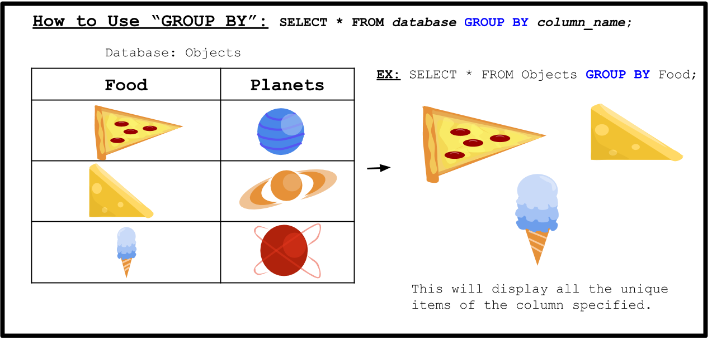

<!-- Links for javascript and CSS needed for drop down logic -->
<link rel="stylesheet" href="../default/_default.css" type="text/css"></link>
<link rel="stylesheet" href="../default/_type.css" type="text/css"></link>

<link rel="stylesheet" href="_activity11.css" type="text/css"></link>

## Fiesta con los habitantes! 

Se te ha dado la tarea de elegir qué comida servir en la fiesta. Cada ciudad tiene su comida favorita y tienes que decidir cuales tener en la fiesta. Usa el comando `GROUP BY` para averiguar qué traer.

### Lo que hace el comando `GROUP BY`:

### Tarea 11: Usando la base de datos llamada 'planet'(planeta) con la columna 'favorite_food'(comida favorita), averigua qué traer a la fiesta.
{}
Pista: El comando es muy similar al ejemplo de arriba.

BONUS: Combina el los comandos `COUNT()` y `GROUP BY` para mostrar el numero de ciudades que les gusta cada comida. 
(Revisa las actividades 3 y 4 para obtener ayuda)

{}



  

    

      <h3 id = "commands" contenteditable="true" onclick="placeholder()">Escribe el comando aquí!</h3>
    

    

      <h3 id = "prev"></h3>
    

    

 
    <button class="button button1" onclick="sql()"> Enter </button>
    

 
    <button class = "button reset" onclick="reset()">Reiniciar</button>
  
 <!-- terminal_div -->

 <!-- content_scaler -->

 
<h1 class="error" id="sqlcommand" style="visibility:hidden"><strong>ERROR ENTRADA INVÁLIDA></strong></h1>
<table id="table">
  <tr></tr>
</table>
<h4 id="story"></h4>

  

    <button class="button cake" id = "cake_button" onclick="highlight('cake_button')"></button>
    <button class="button ice_cream" id = "ic_button" onclick="highlight('ic_button')"></button> 
    <button class="button hot_dog" id = "hd_button" onclick="highlight('hd_button')"></button> 
    <button class="button vendor_reset" id = "vendor_reset" onclick="oven_reset()"> Reiniciar </button> 
    

  
    <button class="button burger" id = "burger_button" onclick="highlight('burger_button')"></button>
    <button class="button pizza" id = "pizza_button" onclick="highlight('pizza_button')"></button>
    <button class="button taco" id = "taco_button" onclick="highlight('taco_button')"></button>
    <button class="button vendor_button" id = "vendor_button" onclick="confirm()"> ¡Cocinar! </button>  
    

 
  
 <!-- vendor_div -->

 <!-- content_scaler -->

 

<h4 id="plot" style="visibility:hidden"> ¡Lo lograste Cadete Espacial! Ahora los habitantes finalmente podrán comenzar la fiesta. </h4> 

<!-- Tells User to continue mission -->

  

    &#10003;
    Completaste la tarea. Continúa con la siguiente misión.
  


