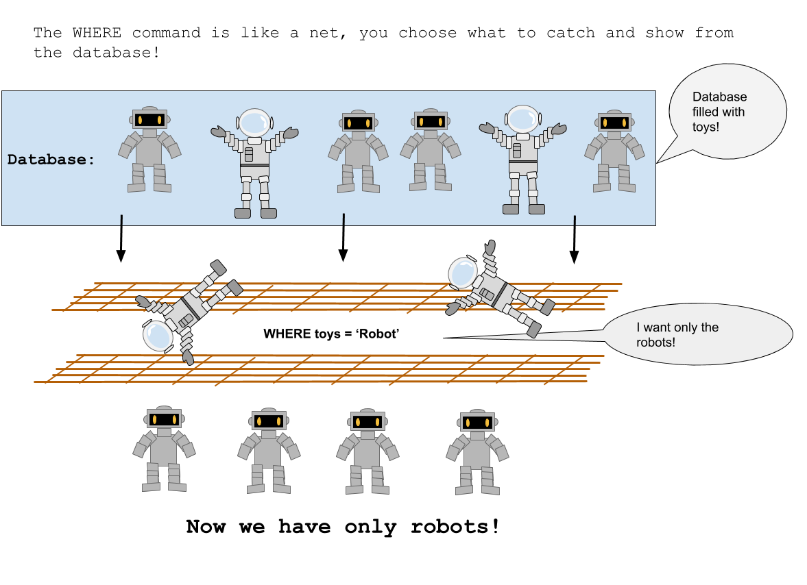
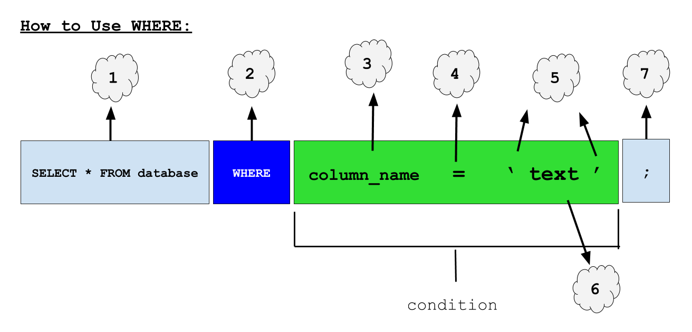
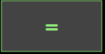

<!-- Links for javascript and CSS needed for drop down logic -->
<link rel="stylesheet" href="../default/_default.css" type="text/css"></link>
<link rel="stylesheet" href="../default/_type.css" type="text/css"></link>
<link rel="stylesheet" href="_activity2.css" type="text/css"></link>

<iframe width="560" height="315" src="https://www.youtube.com/embed/FZnnkNVn0Ok" title="YouTube video player" frameborder="0" allow="accelerometer; autoplay; clipboard-write; encrypted-media; gyroscope; picture-in-picture" allowfullscreen></iframe>

## Tarea 2: ¡Viaja al Planeta de la Diversión!

Necesitas programar el GPS de tus naves espaciales para ir al Planeta de la Diversión reacomodando los bloques de código. Para encontrar las coordenadas, la Federación Galáctica te ha dado el siguiente comando SQL: `WHERE`

{}
### Lo que hace el comando: 
El comando `WHERE` te permite solo mostrar los datos que tu quieres. 

{}

### Ejemplo:

{}
1. El bloque de la base de datos `SELECT * FROM` que aprendimos en la actividad anterior nos permite elegir una base de datos y mirar dentro de ésta. 

2. El comando `WHERE` nos permite reducir los datos que se muestran dependiendo de la condición (el bloque verde en la imagen debajo). Una condición es un requerimiento que estás buscando. Las condiciones no tienen que seguir el ejemplo de arriba, pero su uso más común es buscar los renglones que contengan información específica.

3. El nombre de la columna en la que deseamos buscar información. 
 
4. El signo de igual significa que queremos buscar la información que coincide con lo que tenemos en el lado derecho del signo de igual. 

5. Cuando estamos buscando palabras específicas o texto, debemos rodear el texto con comillas simples. SQL utiliza comillas simples para indicar que estamos buscando una palabra en la base de datos.

6. Puedes reemplazar 'texto' con cualquier palabra que estes buscando en la base de datos. 

7. Los signos de punto y coma se utlizan para indicar el final de un comando SQL, como un punto al final de una oración. 

{}

#### Usando la base de datos llamada 'galaxy' que tiene la columna 'planet,' encuentra las coordenadas para el Planeta de la Diversión. 

<!-- rearrange code blocks on terminal to get coordinate block -->



<!-- Rectangles to Receive blocks -->

 

 

 

 

 

 

  

  

  

  

  

  

  

  

<!-- Press Enter and if correct, unhide coordinate block -->
<button class="button button1" onclick="check()"> Enter </button>

 <!-- terminal_div -->

 <!-- content_scaler -->

<table id="planet" style="visibility:hidden">
  <tr>
  </tr>
  
</table>

<h3> Ahora que sabes donde esta el Planeta de la Diversión, podemos encontrar mas información sobre este e ignorar a otros planetas.  that you know where the Planet of Fun is, we can find more information about it and ignore the other planets. ¡Vamos al Planeta de la Diversión! </h3>

<!-- Tells User to continue mission -->

  

    &#10003;
    ¡Has completado la tarea!¡Continua a la siguiente misión!
  


