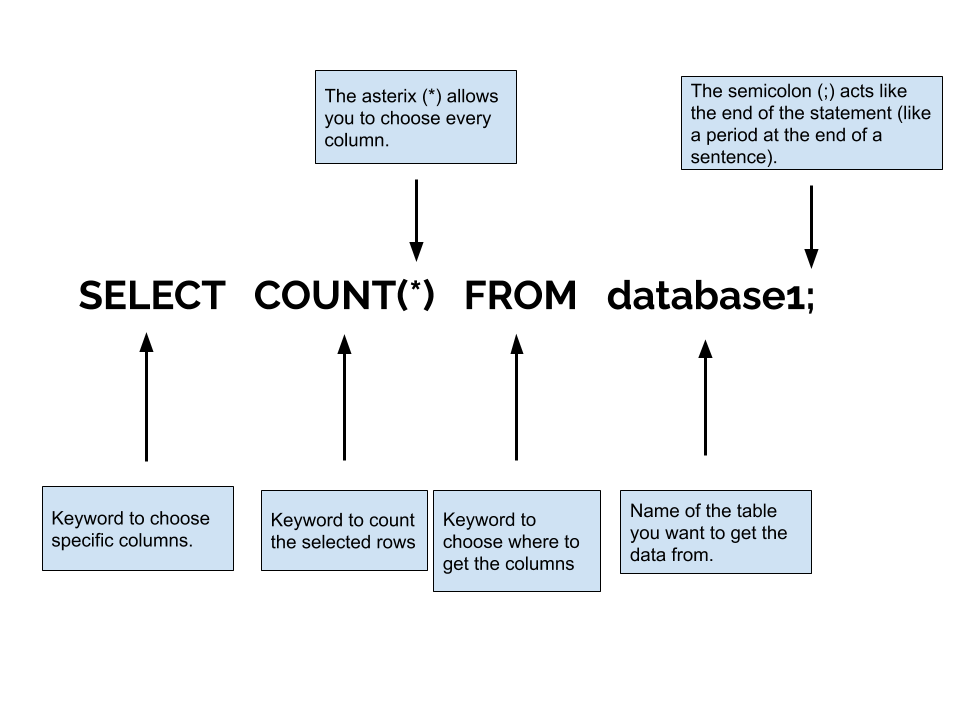

<!-- Links for javascript and CSS needed for drop down logic -->
<link rel="stylesheet" href="../default/_default.css" type="text/css"></link>
<link rel="stylesheet" href="../default/_type.css" type="text/css"></link>

 

Después de recibir el mensaje de la Federación Galáctica, continúas tu aventura.

¡Haz llegado exitosamente al Planeta de la Diversión! La Federación Galáctica te ha enviado una base de datos sobre este planeta. 


  <table id="planettable">
    <tr>
    </tr>
    
  </table>


## Tarea 3: Habla con los habitantes
Necesitas hablar con los habitantes del Planeta de la Diversión para descubrir cuál es el problema. Averigua cuántas ciudades hay en el planeta utilizando el comando `COUNT()`. 

{}
Cuando usamos el comando `SELECT * FROM planet;`, la tabla de arriba se muestra. Pero para verificar el número de ciudades, podemos utilizar el comando `COUNT()`.
{}

### Pregunta: Utilizando `COUNT()`, ¿cuál comando mostrará el número de ciudades en el Planeta de la Diversión? 

{}

Recuerda escribir la respuesta y no copiar y pegar el comando. Presiona el botón de Enter en la terminal para verificar sí tienes el comando correcto. Usa el boton de Reset para comenzar de nuevo.

* Pista 1: La Federacion Galactica te dio el nombre de esta base de datos al principio de esta actividad. 
* Pista 2: Puedes usar el asterisco (*) o el nombre de la columna.
* Pista 3: No olvide agregar el punto y coma. 

{}


  

    

      

        <h3 id = "commands" contenteditable="true" onclick="placeholder()">Escribe el comando aquí</h3>
      

      

        <h3 id = "prev"></h3>
      

      

 
      <button class="button button1" onclick="sql()"> Enter </button>
      

 
      <button class = "button reset" onclick="reset()">Reiniciar</button>
    
 <!-- terminal_div -->
  
 <!-- content_scaler -->
  
  

 

  <h1 class="error" id="sqlcommand" style="visibility:hidden"><strong>ERROR ENTRADA INVÁLIDA</strong></h1>
  <table id="table">
    <tr>
    </tr>
  </table>
  <h4 id="story"></h4>

  <!-- Tells User to continue mission -->
  

    
Encontraste el comando correcto para mostrar la base de datos completa. Esto es útil cuando quieres ver toda la información al alcance de tus dedos.

    

      &#10003;
      ¡Has completado la tarea!¡Continúa a la siguiente misión! 
    

  


