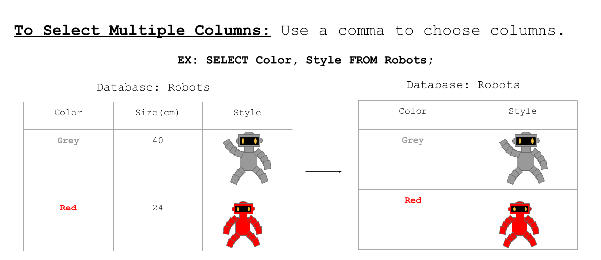

<!-- Links for javascript and CSS needed for drop down logic -->
<link rel="stylesheet" href="../default/_default.css" type="text/css"></link>
<link rel="stylesheet" href="../default/_type.css" type="text/css"></link>

## Tarea 4: Encuentra al Líder

Después de ir a la Capital de Diversión, los habitantes te indican hablar con su Líder. Averigua cuál habitante es el Líder. 

Para completar esta tarea, echemos un vistazo a cómo seleccionar múltiples columnas en la base de datos. 

#### Ahora utiliza lo que aprendiste para averiguar quién es el líder del Planeta de la Diversión

{}
Puedes ver la base de datos completa utilizando el comando `SELECT * FROM [database_name];` que aprendiste en la Actividad 1.

**La Federación Galáctica también te ha enviado un recordatorio sobre la base de datos 'galaxy' tiene las siguientes columnas:**

* planet_number: El orden en el los planetas aparecen en la base de datos. 

* planet: El nombre del planeta. 

* leader: El nombre del líder del planeta. 

* population: La cantidad de habitantes que viven en el planeta.

* coordinate: La ubicación del planeta en la galaxia.

**Pista: Solo se necesitan dos columnas.**

{}

### Pregunta: Ustilizando la base de datos 'galaxy', ¿cómo muestras solo los _nombres de_ los planetas y su líder?

{}
¡No olvides el punto y coma al final!
{}

<!-- SQL Type In Activity -->

  

    

      

        <h3 id = "commands" contenteditable="true" onclick="placeholder()">Escribe el comando aquí</h3>
      

      

        <h3 id = "prev"></h3>
      

        

 
      <button class="button button1" onclick="sql()"> Enter </button>
      

 
      <button class = "button reset" onclick="reset()">Reiniciar</button>
    
 <!-- terminal_div -->
  
 <!-- content_scaler -->
  

 
  <h1 class="error" id="sqlcommand" style="visibility:hidden"><strong>ERROR ENTRADA INVÁLIDA</strong></h1>
  <table id="table">
    <tr>
    </tr>
  </table>
  <h4 id="story"></h4>
  
  <!-- Tells User to continue mission -->
  

    
¡Encontraste el comando correcto para mostrar todos los planetas y sus líderes!

    

      &#10003;
      ¡Has completado la tarea!¡Continúa a la siguiente misión!
    

  

  

