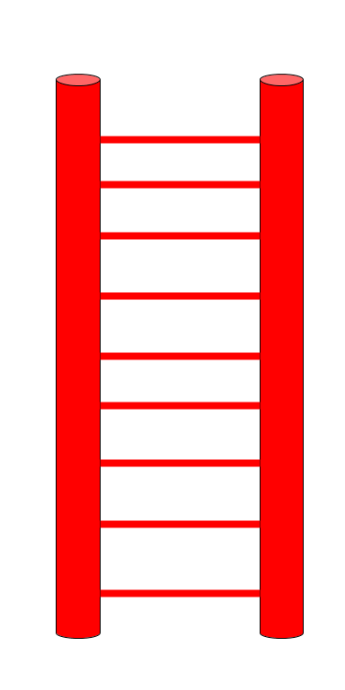

<!-- Links for javascript and CSS needed for drop down logic -->
<link rel="stylesheet" href="../default/_default.css" type="text/css"></link>
<link rel="stylesheet" href="../default/_type.css" type="text/css"></link>
<link rel="stylesheet" href="_activity5.css" type="text/css"></link>

<iframe width="560" height="315" src="https://www.youtube.com/embed/VPMZedGI-Ww" title="YouTube video player" frameborder="0" allow="accelerometer; autoplay; clipboard-write; encrypted-media; gyroscope; picture-in-picture" allowfullscreen></iframe>

## Tarea 5: Encuentra la escalera más alta para llegar con su Líder

Haz descubierto que el líder del planeta está en una cabaña en la colina más alta pero para llegar ahi, necesitas encontrar la escalera más alta en la Capital de la Diversión

La Federación Galáctica te ha enviado cuatro comandos SQL nuevos. ¡Vamos a echarles un vistazo!

### Lo que hace el comando:

 

{}
La propiedad de la columna:
`MAX()` es utilizada para buscar el valor más alto en una columna. `MIN()` es lo opuesto de `MAX()` y buscará el valor más chico en una columna. 
Puedes reemplazar cualquier palabra dentro de los paréntesis con el nombre de otra columna para obtener el valor més alto o chico de esa columna. 
{}

{}
Fíjate en cómo los elementos especificados dentro `IN()` y `NOT IN()` están rodeados por comillas simples pero las que están dentro de `MAX()` y `MIN()` no lo están.

 

Condición:
* `IN()` y `NOT IN()` son usados mano a mano con el comando `WHERE` que aprendimos en la Actividad 2. `IN()` es parte de la condición de un comando SQL y es útil cuando sólo quieres mostrar algunas columnas y no todas. 

* `NOT IN()` es lo opuesto de `IN()`. En lugar de elegir qué mostrar como el comando `IN()`, `NOT IN()` mostrará todas las columnas que no elegiste dentro dentro de los paréntesis.

* Puedes usar comas dentro de los paréntesis para elegir más de una columa qué mostrar o no. 

* Usar solo un input (entrada de datos) dentro de `IN()` es equivalente a usar `=`. 

Ejemplo. `column_name IN('obejct_in_column');` es lo mismo que `column_name = 'obejct_in_column';`
{}

### ¡Ahora utiliza lo que aprendiste! Usando la base de datos llamada 'items' con las columnas 'object' y 'height', encuentra la escalera ('ladder') más alta.
{}
Puedes mostrar la base de datos utilizando el comando de la Actividad 1.

* Pista 1: Recuerda el consejo de la Federacion Galactica:`SELECT [column/column property] FROM [database] [optional condition];`

* Pista 2: La propiedad de la columna: ¿Necesitas usar `MAX()` o `MIN()` para encontrar la escalera mas alta?

* Pista 3: Condición: `WHERE [column_name] [IN/NOT IN];`

* Pista 4: ¿Necesitas usar `IN()` o `NOT IN()` para mostrar la escalera ('ladder')?

* Pista 5: ¿Cuál símbolo necesitas al final de un comando SQL?
{}
 
{}
* BONUS: Intenta usar múltiples inputs (entradas de datos) dentro de `IN()` o `NOT IN()` cuando estés buscando la escalera. 
* Este comando es muy poderoso cuando estas buscando múltiples tipos de objetos.
{}

{}
Recuerda: Puedes consultar la base datos múltiples veces usando todo lo que has aprendido hasta ahora para encontrar el color de la escalera más alta. 
{}

<!-- SQL Type In Activity -->



  

    

      

        <h3 id = "commands" contenteditable="true" onclick="placeholder()">Type command here!</h3>
      

      

        <h3 id = "prev"></h3>
      

        

 
      <button class="button button1" onclick="sql()"> Enter </button>
      

 
      <button class = "button reset" onclick="reset()">Reset</button>
    
 <!-- terminal_div -->
  
 <!-- content_scaler -->
  

  <h1 class="error" id="sqlcommand" style="visibility:hidden"><strong>ERROR INVALID INPUT></strong></h1>
  <table id="table">
    <tr></tr>
  </table>
  
  <h4 id="story"></h4>

  

      
    
 RED Ladder = 100 

    
 GREEN Ladder = 60 

    
 YELLOW Ladder = 20 

     
  



### ¡Elige y arrastra la escalera correcta en la colina para continuar tu aventura!

{}
La escalera correcta resaltará en verde. 
{}



<!-- Player drags ladder block to drop block to finish mission -->

<!-- Drop Location -->

 

<!-- Drag Block -->

  

  

  

 <!-- hill_div -->

 <!-- content_scaler -->

 

<!-- Next mission text displays -->

  
 ¡Lo lograste! El Lider te comunica que el Planeta de la Diversión está en riesgo de ser invadido por aliens del Planeta del Aburrimiento. 
  ¡Debes encontrar los Tótems de la Diversión para salvar al planeta! 

<!-- Tells User to continue mission -->

  

    &#10003;
    ¡Has completado la tarea!¡Continúa a la siguiente misión!
  


