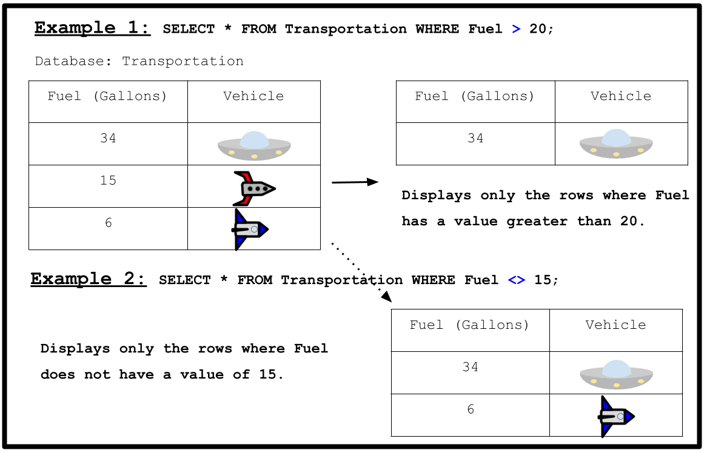

<!-- Links for javascript and CSS needed for drop down logic -->
<link rel="stylesheet" href="../default/_default.css" type="text/css"></link>
<link rel="stylesheet" href="../default/_type.css" type="text/css"></link>

<iframe width="560" height="315" src="https://www.youtube.com/embed/WeTYg1YnbHA" title="YouTube video player" frameborder="0" allow="accelerometer; autoplay; clipboard-write; encrypted-media; gyroscope; picture-in-picture" allowfullscreen></iframe>

## Tarea 6: Encuentra el Tótem Lengedario de la Diversión, el Cañón de Confeti  

Necesitas explorar el planeta y encontrar el primer Tótem Legendario de la Diversión: el Cañón de Confeti de la Diversión. 
La leyenda cuenta que este cañón nunca deja de lanzar confeti ya que es un símbolo de paz y entretenimiento infinito. 

{}
**Tu única pista es que el artefacto es creado el 1738-09-12.**
{}
Para ayudarte, la Federación Galáctica te ha enviado un tutorial breve de cómo comparar los números en la base de datos. 

{}
* En el ejemplo 2, los símbolos `!=` pueden ser utilizados en vez de `<>` para darte el mismo output (salida de datos).
* Fíjate en el valor en `[value to compare]` en `SELECT * FROM [database] WHERE [column_name] [Comparator] [value to compare];` Toma en cuenta que los números no necesitan comillas simples alrededor, pero los datos/palabras si necesitan estar dentro de comillas simples. Sí Transportation/Transporte tuviera 2 columnas más llamadas "Nombre" que almacenaran el nombre del vehículo y "Fecha" que almacenara la fecha de fabricación del vehículo, las consultaríamos así:

    `SELECT * FROM Transportation WHERE Fuel > 20;`

    `SELECT * FROM Transportation WHERE Name = 'myrocket';`

    `SELECT * FROM Transportation WHERE Date > '2021-01-01';`
{}

### Utilizando la base de datos llamada 'items' con la columna 'date_created', averigua cuál artefacto es el Tótem Legendario de la Diversión: el Canón de Confeti

{}
Puedes mostrar la base de datos utilizando el comando de la Actividad 1. 

Pista 1: El artefacto se creó en '1738-09-12' (use comillas simples alrededor de la fecha).
* Sugerencia 2: ¿Qué comparador necesita usar para encontrar una coincidencia exacta?
* Pista 3: El comando correcto sigue de cerca el ejemplo anterior.
* Sugerencia 4: No necesita comillas simples alrededor de los nombres de las columnas o bases de datos en este comando.
* Pista 5: ¿Qué símbolo necesita al final de un comando SQL?

* BONUS: ¡Muestra también todos los objetos creados a partir de '1738-09-12'!

* Pista 1: El artefacto se creó en '1738-09-12' (use comillas simples alrededor de la fecha).
* Pista 2: ¿Qué comparador necesitas usar para encontrar una coincidencia exacta de datos?
* Pista 3: El comando correcto es similar al ejemplo de arriba. 
* Pista 4: No necesitas comillas simples alrededor de los nombres de las columnas o bases de datos en este comando. 
* Pista 5: ¿Qué símbolo necesitas al final de un comando SQL?
* BONUS: ¡Muestra también todos los objetos creados a partir de '1738-09-12'!
{}

<!-- SQL Type In Activity -->


  

    

      

        <h3 id = "commands" contenteditable="true" onclick="placeholder()">Type command here!</h3>
      

      

        <h3 id = "prev"></h3>
      

      

 
      <button class="button button1" onclick="sql()">Enter</button>
      

 
      <button class = "button reset" onclick="reset()">Reset</button>
    

  

  

 
  <h1 class="error" id="sqlcommand" style="visibility:hidden"><strong>ERROR INVALID INPUT></strong></h1>
  <table id="table">
    <tr></tr>
  </table>
  <h4 id="story"></h4>

  

    
 Has encontrado la ubicación del primer Tótem Legendario de la Diversión: ¡el Cañón de Confeti!

  

  <!-- Unhide the Confetti Cannon -->
  
  
  <!-- Tells User to continue mission -->
  

    

      &#10003;
      ¡Haz completado la tarea!¡Continúa a la siguiente misión!
    

  


