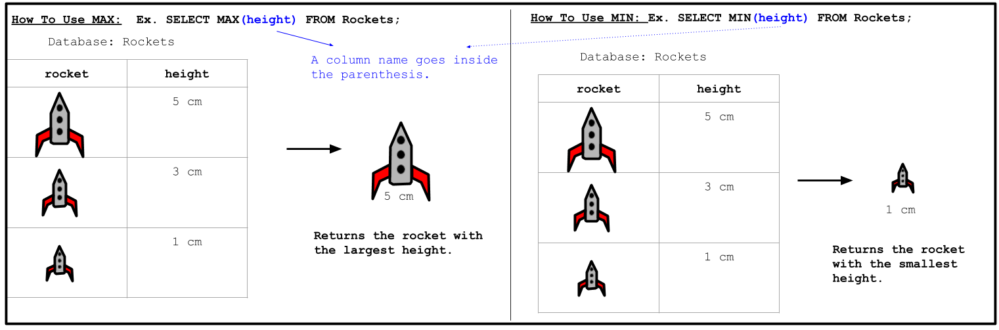
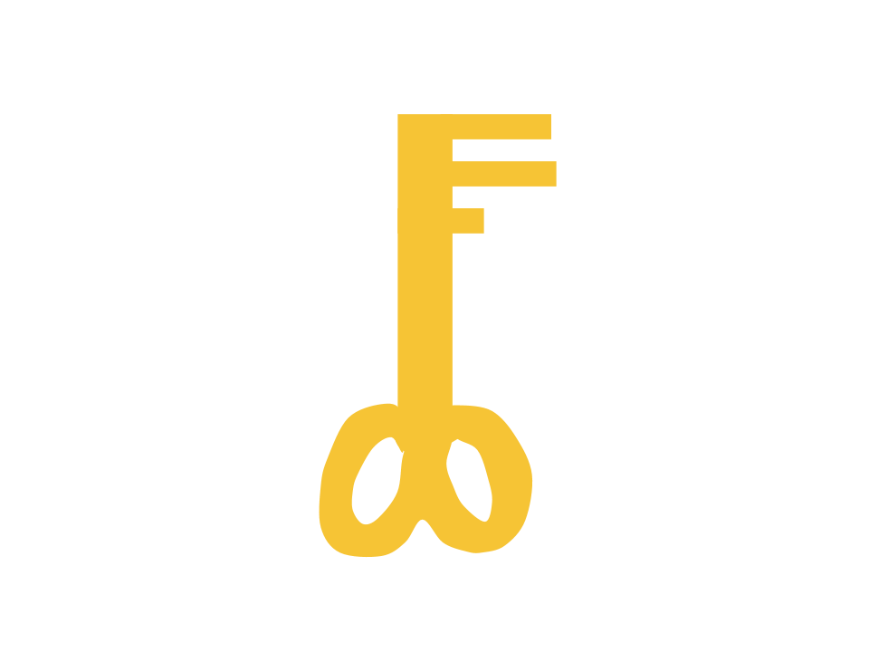

<!-- Links for javascript and CSS needed for drop down logic -->
<link rel="stylesheet" href="../default/_default.css" type="text/css"></link>
<link rel="stylesheet" href="../default/_type.css" type="text/css"></link>
<link rel="stylesheet" href="_activity7.css" type="text/css"></link>

## Tarea 7: Encuentra la llave para conseguir el Cañón de Confeti.

Encontraste la ubicación del Legendario Cañon de Confeti pero está encerrado detrás de una puerta de titanio y solo puede ser abierta con la llave más pequeña del planeta.

**Para ayudarte, la Federación Gálactica te ha enviado un recordatorio de la actividad anterior sobre cómo usar el comando `MIN()`.**

#### Usando la base de datos llamada <i>'items'</i> (artículos) con columnas etiquetadas como <i>'object'</i> (objeto) y <i>'height'</i>(altura), encuentra la <i>'key'</i> (llave) con la menor altura. 
{}
Puedes mostrar la base de datos entera usando el comando de la actividad 1.

* Pista 1: Recuerda el consejo de la Federación Gálactica: `SELECT [columna/propiedad de columna] FROM [base de datos] [condicionales opcionales];`

* Pista 2: Condicionales `WHERE [column_name] [IN()/NOT IN()];` 

* Pista 3: ¿Necesitar usar `IN()` o `NOT IN()` para mostrar la 'key' (llave)?
{}
<!-- SQL Type In Activity -->



  

    

      

        <h3 id = "commands" contenteditable="true" onclick="placeholder()">Escribe el comando aquí</h3>
      

      

        <h3 id = "prev"></h3>
      

      

 
      <button class="button button1" onclick="sql()"> Enter </button>
      

 
      <button class = "button reset" onclick="reset()">Reiniciar</button>
    
 <!-- terminal_div -->
  
 <!-- content_scaler -->
  

 
  <h1 class="error" id="sqlcommand" style="visibility:hidden"><strong>ERROR ENTRADA INVÁLIDA</strong></h1>
  <table id="table">
    <tr></tr>
  </table>
  <h4 id="story"></h4>

<h4 id="story"></h4>

 


### Elige y arrastra la llave correcta en el candado para continuar con tu adventura.
{}
La altura corresponde al numero de bucles en la base de la llave. La llave correcta estará destacada con color verde.
{}



  <!-- Player drags key block to drop block to finish mission -->
  

    

    

 

    <!-- Position of first key -->
    

      
    
 

    <!-- Drag Block -->
    

      
    
 

    

      
    
 

    <!-- Drop Location -->
    
 

  
 <!-- door_div -->

 <!-- content_scaler -->

<!-- Next mission text displays -->

  <h3> ¡Encontraste el Tótem Legendario: el Cañón de Confeti!</h3>

<!-- Unhide the Confetti Cannon -->

<!-- Tells User to continue mission -->

  

    &#10003;
    Completaste la tarea. Continúa con la siguiente misión.
  


