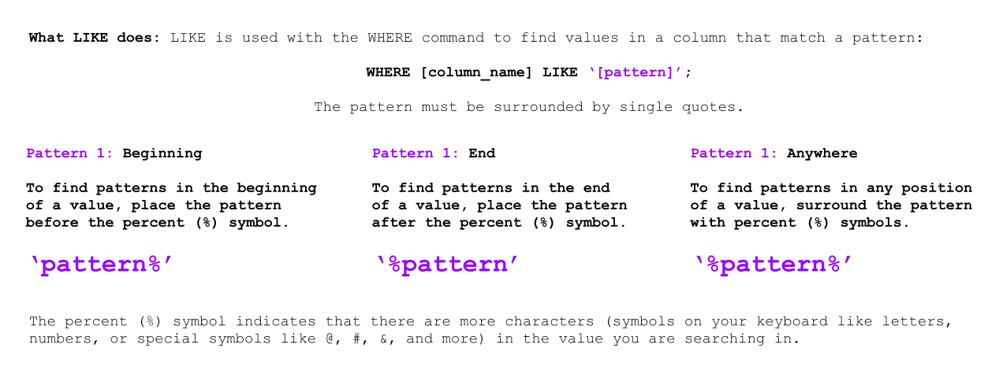
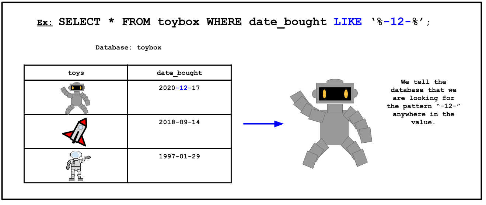

<!-- Links for javascript and CSS needed for drop down logic -->
<link rel="stylesheet" href="../default/_default.css" type="text/css"></link>
<link rel="stylesheet" href="../default/_type.css" type="text/css"></link>

<link rel="stylesheet" href="_activity8.css" type="text/css"></link>

<iframe width="560" height="315" src="https://www.youtube.com/embed/dPk644r21e0" title="YouTube video player" frameborder="0" allow="accelerometer; autoplay; clipboard-write; encrypted-media; gyroscope; picture-in-picture" allowfullscreen></iframe>

## Task 8: Find the Legendary Totem of Fun: Infinite Buffet Table

Another artifact you must find is the infinite buffet table of fun! Legends say that festivals will never run 
out of food with this mystic buffet table. 

{}
This Totem was created a month after the previous artifact: 
the Confetti Cannon (reminder: the Confetti Cannon was created on 1738-09-12).
{}

**The Galactic Federation has sent you a brief tutorial on a handy command: `LIKE`**

#### Using the database called 'items' with a column labeled 'date_created', find the Infinite Buffet Table!
{}
You can use the command in activity 1 to display the entire database.

* Hint 1: The format for the date is Year-Month-Day.
* Hint 2: This Totem was created a month AFTER the Confetti Cannon (1738-09-12).
* Hint 3: What is the pattern? Do you need to look for the month at the beginning, end, or anywhere of the value?
{}
<!-- SQL Type In Activity -->



  

    

      

        <h3 id = "commands" contenteditable="true" onclick="placeholder()">Type command here!</h3>
      

      

        <h3 id = "prev"></h3>
      

      

 
      <button class="button button1" onclick="sql()"> Enter </button>
      

 
      <button class = "button reset" onclick="reset()">Reset</button>
    
 <!-- terminal_div -->
  
 <!-- content_scaler -->
  

 
  <h1 class="error" id="sqlcommand" style="visibility:hidden"><strong>ERROR INVALID INPUT></strong></h1>
  <table id="table">
    <tr></tr>
  </table>
  <h4 id="story"></h4>

  <h4> You found the location of the Legendary Totem of Fun: Infinite Buffet Table! Now we will travel to Fun Capital!</h4>

 

<!-- Unhide the buffet table location -->

<!-- Tells User to continue mission -->

  

    &#10003;
    You've completed the task! Continue to the next mission!
  


