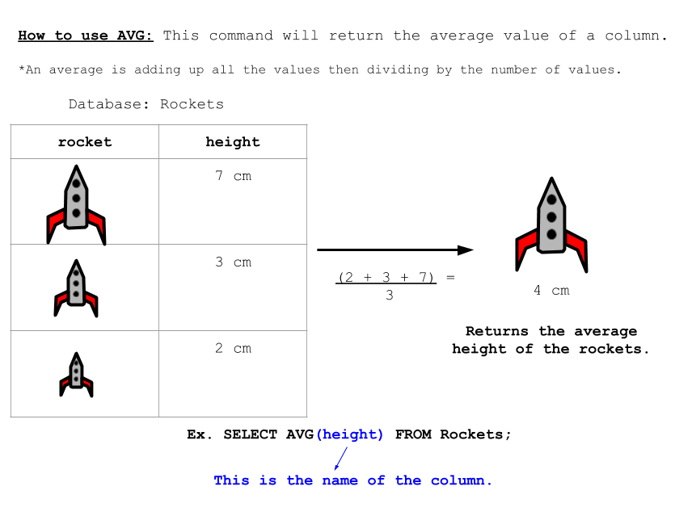

<!-- Links for javascript and CSS needed for drop down logic -->
<link rel="stylesheet" href="../default/_default.css" type="text/css"></link>
<link rel="stylesheet" href="../default/_type.css" type="text/css"></link>

<link rel="stylesheet" href="_activity9.css" type="text/css"></link>

<iframe width="560" height="315" src="https://www.youtube.com/embed/XLm2T6XBltg" title="YouTube video player" frameborder="0" allow="accelerometer; autoplay; clipboard-write; encrypted-media; gyroscope; picture-in-picture" allowfullscreen></iframe>

## Tarea 9: Desbloquea la Mesa de Buffet Infinito:

¡Haz descubirto la ubicación de la Mesa de Buffet Infinito! Sin embargo, está encerrada detrás de una puerta que sólo se abre si encuentras el número secreto.

{}
Tu única pista es que la combinación es los primeros dos dígitos de la población promedio de la ciudad.
{}

**Repasemos el comando `AVG()`**

#### Usando la base de datos 'planet' y el comando `AVG()`, encuentra los primeros dos dígitos del promedio de la población ('population') de la ciudad.
{}
Usa el comando de la actividad 1 para ver la base de datos entera.

* Pista 1: El comando es muy similar al ejemplo de arriba.

* Pista 2: ¿Cómo usas 'population'(población) con el comando `AVG()`?

{}
<!-- SQL Type In Activity -->


  

    

      

        <h3 id = "commands" contenteditable="true" onclick="placeholder()">Escribe el comando aquí</h3>
      

      

        <h3 id = "prev"></h3>
      

      

 
      <button class="button button1" onclick="sql()"> Enter </button>
      

 
      <button class = "button reset" onclick="reset()">Reiniciar</button>
    
 <!-- terminal_div -->
  
 <!-- content_scaler -->
  

 
  <h1 class="error" id="sqlcommand" style="visibility:hidden"><strong>ERROR ENTRADA INVÁLIDA</strong></h1>
  <table id="table">
    <tr></tr>
  </table>
  <h4 id="story"></h4>



### ¡Descubre la combinación para abrir la caja fuerte!
{}
La pista para la combinación está arriba en esta página.
{}



  

    

    <button class="button first_up" id = "first_up" onclick="add(1)"> + </button>
    <button class="button sec_up" id = "sec_up" onclick="add(2)"> + </button> 
    
    

 
    
    <textarea class="lock" id="lock1" readonly>0</textarea>
    <textarea class="lock" id="lock2" readonly>0</textarea>
    
    <button class="button first_down" id = "first_down" onclick="subtract(-1)" style="clear:left;"> - </button>
    <button class="button sec_down" id = "sec_down" onclick="subtract(-2)"> - </button>
    

    

    <button class="button vault_button" id = "vault_button" onclick="confirm()"> Check </button>
    

    
    

 

  
 <!-- vault_div -->

 <!-- content_scaler -->

 

<h5 id="plot" style="visibility:hidden"> ¡Lo lograste, Explorador Espacial! Encontraste el Tótem Legendario del planeta Fun: la Mesa de Buffet Infinito. </h5> 

<!-- Unhide the Infinite Buffet Table -->

<!-- Tells User to continue mission -->

  

    &#10003;
    Completaste la tarea. Continúa con la siguiente misión.
  


