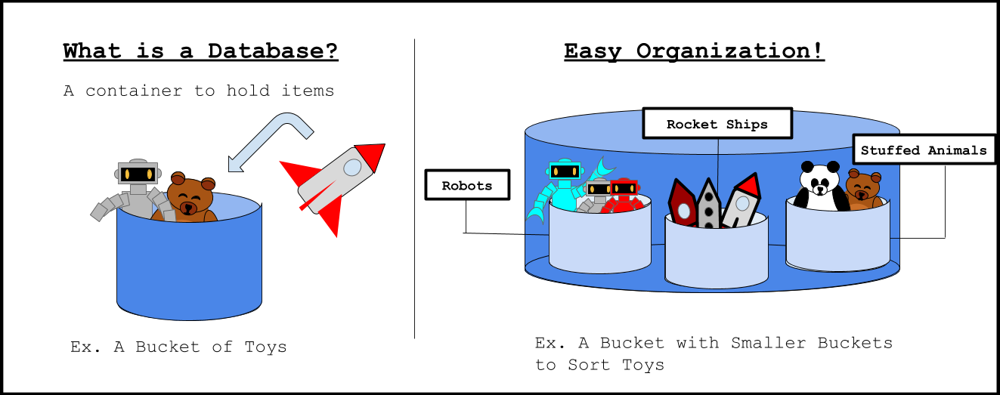
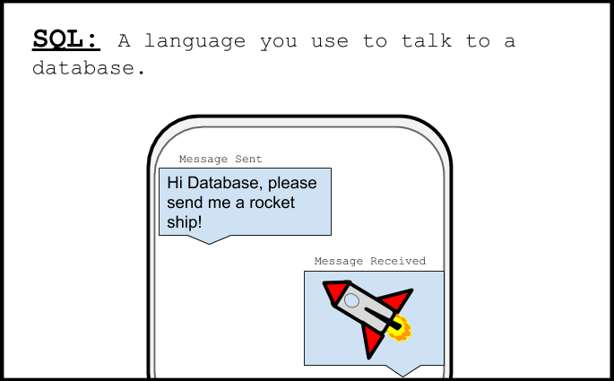

# ¡Entrenamiento de cadete!
Como un nuevo explorador del espacio honorífico, repasemos los pasos esenciales!

## ¿Qué es una Base de Datos?

 Es un tipo de contenedor que almacena y organiza información.
Piensa que una base de datos es como un bote donde puedes colocar juguetes para que no se pierdan
y para que puedas encontrarlos fácilmente después. Este bote puede tener otros botes más pequeños
para ayudarte a clasificar tus juguetes.

## ¿Qués es SQL?

Por sus iniciales en inglés, "Structured Query Language" que significa Lenguaje de Consulta Estructurado,
y como su nombre lo dice, es un lenguaje que te permite hablar con las bases de datos para acceder a la
información que necesitas. Un comando de SQL es como una oración que le dices a la base de datos. 

## ¿Qué es una tabla?

Una tabla puede ser una base de datos.

Ahora que tienes cierto conocimiento de las bases de datos y de los comandos de SQL, comenzarás a aprender cómo usarlos en tus misiones.Continúa para empezar tu primera aventura espacial oficial.
