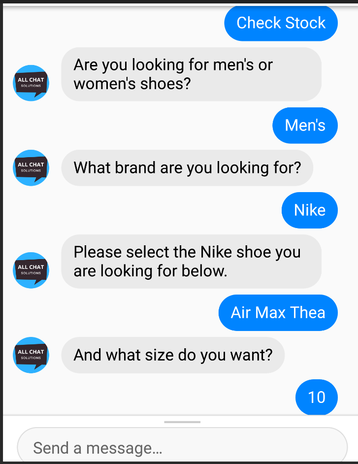

## 소개
이 워크숍에서는 자신만의 챗봇을 만드는 방법을 배우게 됩니다. 본 워크숍을 수료하면 사용자와 간단한 대화를 나눌 수 있는 챗봇을 만들게 될 것입니다. 또한 챗봇을 만들기 위한 언어인 AIML을 사용하는 방법을 배우고, Pandorabots라는 플랫폼을 사용하여 챗봇을 호스팅하는 방법도 익히게 됩니다.

워크숍을 수료하려면 Pandorabots 계정 가입을 위한 이메일 주소가 필요합니다.

## 챗봇의 정의
챗봇은 질문에 답변하기 위해 인간의 대화를 모방하는 컴퓨터 프로그램입니다. 

## 챗봇의 예시
여러분은 일상생활에서 이미 챗봇과 대화해본 경험이 있을 것 입니다. 

예를 들어, 스마트 비서(virtual assistant)를 사용해 휴대전화에서 알람을 설정하거나 스마트 스피커에서 음악을 재생한 적이 있을 것입니다.

또는 제품이나 서비스와 관련된 도움을 받기 위해 챗봇과 대화를 나눈 적도 있을 것 입니다.

최근에는 ChatGPT와 같은 기술 덕분에 챗봇이 더욱 알려지게 되었습니다.

## 챗봇의 역사
챗봇은 오랜 역사를 가지고 있습니다. 최초의 챗봇은 1966년에 만들어졌으며, 그 이름은 ELIZA입니다. 1995년에는 AIML로 작성된 새로운 챗봇인 ALICE가 개발되었습니다. 이번 워크숍에서는 AIML을 사용하여 챗봇을 만들게 됩니다.

## 목차

목차

{}

