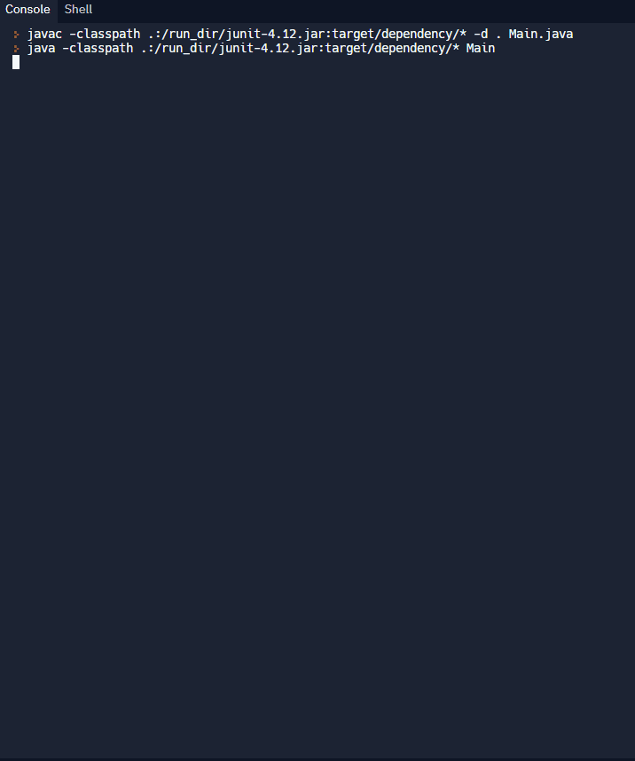

{}
#### Prerequisites (from Java: Basics)

- activity-1: <a href="../../java-basics/activity-1" target="_blank">출력문과 주석(Print Statements and Comments)</a>
- activity-2: <a href="../../java-basics/activity-2" target="_blank">변수와 유형(Variables and Types)</a>
- activity-3: <a href="../../java-basics/activity-3" target="_blank">: 연산자(Operators)</a>
- activity-5: <a href="../../java-basics/activity-5" target="_blank">메서드(Methods)</a>
- activity-6: <a href="../../java-basics/activity-6" target="_blank">객체와 클래스(Object and Classes)</a>
- activity-7: <a href="../../java-basics/activity-7" target="_blank">데이터 구조: 배열 & 배열 목록(Data Structures: Array & ArrayList)</a>

이 활동에서는 자바 기본(Java: Basics) 워크숍에서 다룬 개념들을 사용합니다. 학습을 진행하기 전에 이 개념들을 복습하거나 처음 배워야 한다면 해당 활동을 참고하세요!
{}

## 개요

이 워크숍에서는 자바를 사용하여 틱택토(Tic-Tac-Toe) 프로그램을 처음부터 끝까지 만드는 방법을 배웁니다!

자바 기본 워크숍에서 배운 자바의 기초 지식이 필요합니다. 변수, 연산자, 클래스, 배열 등의 개념을 알고 있다는 가정하에 진행됩니다.

각 페이지에는 관련 자바 개념에 대한 링크도 포함되어 있으니, 특정 개념을 복습하고 싶다면 링크를 참고하세요!

(image created by ParkerPup: giphy.com/parkerpup)

## 목차

목차

{}

## 미리보기

아래 GIF는 이 워크숍을 완료했을 때 여러분이 만들 프로그램을 보여줍니다! 확인해보세요!

<iframe height="600px" width="100%" 
 src="https://replit.com/@nuevofoundation/JavaTicTacToeDemo?lite=true&outputonly=1" scrolling="no" frameborder="no" allowtransparency="true" allowfullscreen="true" sandbox="allow-forms allow-pointer-lock allow-popups allow-same-origin allow-scripts allow-modals"></iframe>
