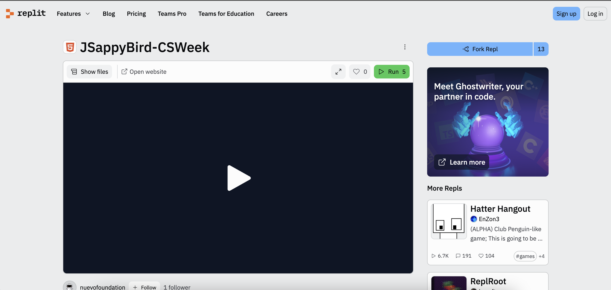
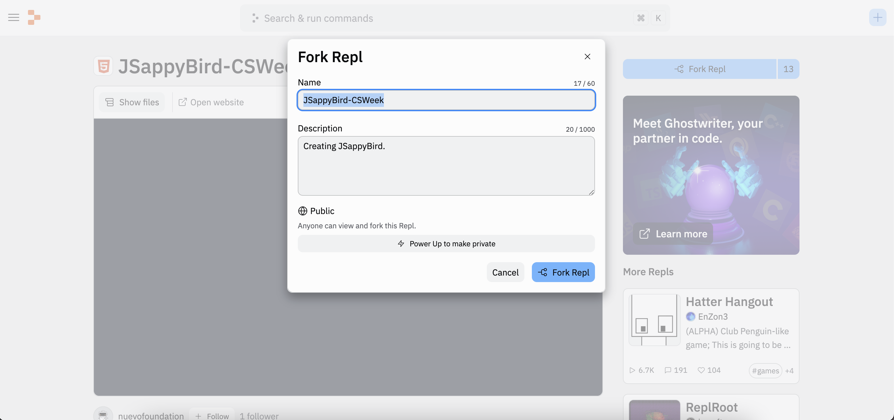

## 소개

여러분은 아마도 플래피 버드(Flappy Bird) 게임에 익숙할 것 입니다. 이 워크숍에서는 JavaScript 언어를 사용하여 여러분만의 플래피 버드 게임을 만드는 방법을 배울 것입니다! 도전할 준비가 되셨나요?

<iframe src="https://giphy.com/embed/euuaA2cwLEUuI" width="350" height="350" frameBorder="0" class="giphy-embed"></iframe>

이미 익숙한 플래피 버드 게임을 직접 만들어보고, 친구들에게도 보여줄 수 있습니다! 이번 튜토리얼에서는 여러분이 만든 세계에서 새가 움직일 수 있도록 JavaScript 언어를 배우게 됩니다.

## 시작하기

활동의 목표는 JavaScript 기술을 배우고, 배운 지식을 활용해 플래피 버드 게임을 만드는 것입니다. 이제 게임을 만들어 봅시다.

오늘 우리는 “Replit”을 사용할 것입니다. 시작하기 전에, 아직 계정이 없다면 “Replit”계정을 만들어 주세요.

아래 버튼을 클릭하여 “Replit”계정에 가입할 수 있습니다. 가입에는 이메일 계정이 필요합니다. 이미 “Replit”계정이 있다면 아래 버튼을 통해 로그인할 수 있습니다.

<a class="my-2 mx-4 btn btn-info" href="https://replit.com/signup" target="_blank">Replit 가입하기</a>

이제 오늘 사용할 “Replit” 콘솔을 실행하려면 아래 버튼을 클릭하세요. 다음과 같은 화면이 나와야 합니다.

<a class="my-2 mx-4 btn btn-info" href="https://replit.com/@nuevofoundation/JSappyBird-CSWeek" target="_blank">Replit 실행하기</a>

다음으로, Repl을 포크(fork)하여 프로그램의 복사본을 만들어 나만의 수정 작업을 할 수 있습니다. 오른쪽 상단의 “Fork Repl” 버튼을 클릭한 후, 다시 “Fork Repl” 버튼을 클릭하세요.

Replit을 포크하면 다음과 같은 화면이 나타날 것입니다:

이 화면에서 일부 세부사항은 넘어가도 되지만, 화면에 표시된 기본 사항 몇 가지를 확인해 보겠습니다. index.html 파일과 .js 파일에는 컴퓨터가 실행할 명령어(코드)가 들어 있습니다.**run** 버튼을 누르면 컴퓨터가 코드의 명령을 실행하고, 실행 결과는 오른쪽의 **console**에 표시됩니다.

지금 **run**을 눌러 보면 아직 아무것도 나타나지 않을 것입니다! 여러분의 역할은 Nuvi를 도와 이 게임의 코드를 완성하는 것입니다.

**Activity** 섹션에 나오는 모든 활동은 이 브라우저 탭에서 진행합니다. 여러분이 직접 활동을 수행하게 되지만, 어려울 때는 도움을 받을 수 있습니다.

## 목차

목차

{}

