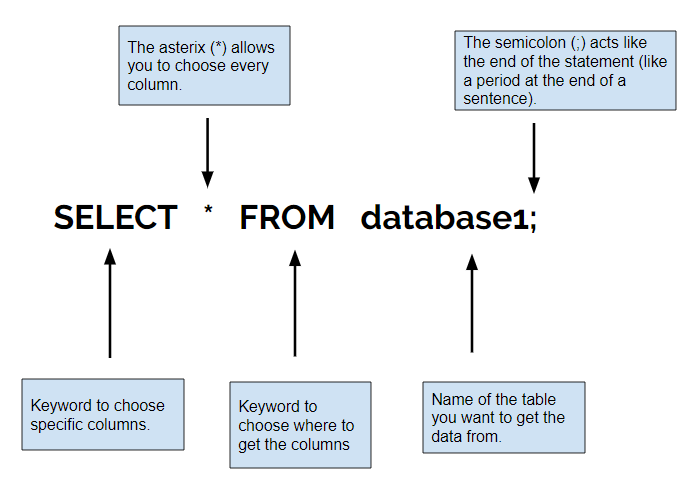

# Mission 1: Save the Planet of Fun From Boredom!

## Task 1: Take a peek at the information on the Planet of Fun - Learn SELECT

**What the command does:** The SELECT command allows you to choose what data to show from a database.

**Example:**

Now use what you learned! **Rearrange the code blocks below to answer the question and continue your space adventure!**

### Question: What command will display all the columns in the database called "Friends"?

 

 

 

 

 

 

<button class="button button1">Enter </button>
