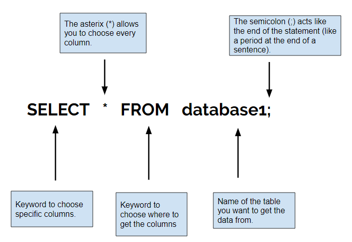
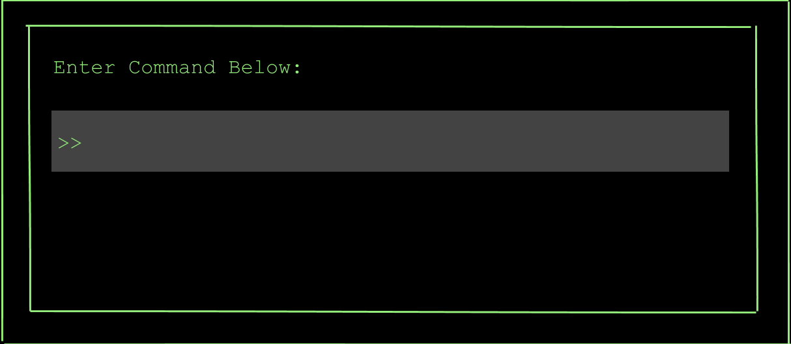

# 
<b>Mission 1: Save the Planet of Fun From Boredom!</b>

## <b> Task 1: Take a peek at the information on the Planet of Fun - Learn SELECT </b>

<b>What the command does:</b> The SELECT command allows you to choose what data to show from a database.

<b>Example:</b>

Now use what you learned! <b>Rearrange the code blocks below to answer the question
and continue your space adventure!</b>

<b>  
Question: What command will display all the columns
in the database called "Friends"? </b>  

 

	
	

		
	

	

		
	

	

		
	

	

		
	

	
	

		
	

	
	
	
 

	
 
 
	
 

		
	
 
 
	
 

	

	<button class="button button1">Enter </button>

